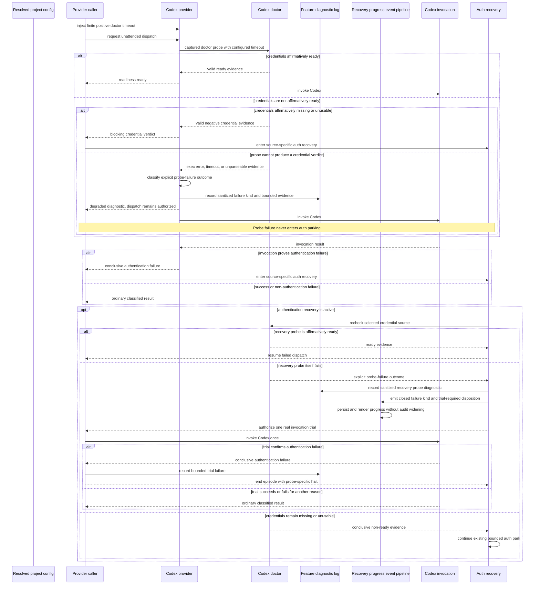

# Sequence: Codex Readiness Probe Failure Separation

**Last updated:** 2026-07-30
**Scope:** Planned issue #1039 behavior for Codex doctor evidence, degraded diagnostics, dispatch authorization, and authentication recovery.

## Diagram

## Invariants

- Only affirmative `missing` or `unusable` credential evidence, or a real invocation's authentication failure, authorizes authentication recovery.
- Doctor execution errors, timeouts, unsupported or malformed output, and unrecognized envelopes are explicit probe failures. They emit secret-safe diagnostics and do not block dispatch.
- If a recovery probe fails after credentials were already known non-ready, the coordinator authorizes one real invocation trial. A trial that confirms authentication failure ends that recovery episode with a probe-specific diagnostic; it cannot create an unbounded bypass loop.
- The readiness result preserves the selected authentication source and distinguishes the probe-failure kind without carrying raw credential material.
- The doctor timeout is resolved from reviewed configuration rather than a private hardcoded constant.
- Existing provider fallback, model fallback, retry, and escalation behavior is unchanged by a degraded readiness diagnostic.

## Plan Alignment

- Tasks 1-9 define and consume the exhaustive readiness union at the shared Codex provider boundary, including bounded secret-safe diagnostics.
- Tasks 10-11 resolve and inject the readiness-only doctor timeout through the CLI and daemon composition roots.
- Tasks 12-16 implement the explicit recovery disposition and its one-trial/no-recursion handling across serial, grouped, and auxiliary callers.
- Task 17 carries recovery probe metadata through the existing progress event, persister, and renderer without widening the audit allowlist.
- Tasks 18-20 prove the provider, runtime, recovery, and adapter propagation paths with deterministic fakes.

## Diagram Impact Boundary

Issue #1039 changes an internal provider sequence and configuration seam. It introduces no deployable container, datastore, database relationship, user type, or external integration, so system-context, container, component, and ERD diagrams do not require updates.

## Legend

- A **blocking credential verdict** is affirmative evidence about the selected credential source.
- A **probe failure** means the harness could not obtain trustworthy credential evidence; it is diagnostic, not authorization to halt or park.
- The feature diagnostic log is the existing per-feature persisted daemon logging boundary.

## Change Log

| Date | Change | Reason |
|------|--------|--------|
| 2026-07-29 | Initial sequence | DECIDE architecture input for issue #1039, Medium tier |
| 2026-07-30 | Added resolved-timeout injection, recovery progress consumers, and task alignment | Plan-update pass after the 20-task implementation plan |
