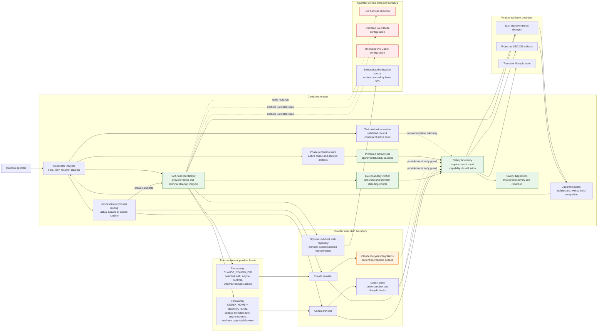

# Components: Codex Safety and Self-Host Parity (#907)

**Last updated:** 2026-07-26
**Scope:** The current Claude-shaped safety surfaces, the provider-neutral engine seams
that already own lifecycle and judgment, and the required ownership boundary for
task-local telemetry, mutation protection, protected artifacts, and symmetric self-host isolation.

## Component Diagram

## Boundary Notes

- The conductor already owns step, retry, resume, phase, and cleanup lifecycles.
- Task rows represent a concurrent active set. Task ids and commit trailers are telemetry;
  no workspace-global current-task value authorizes mutation or completion.
- The required safety authority owns outcomes, not provider API symmetry. Claude
  lifecycle integration may remain as a compatibility signal, but it is not the
  correctness boundary.
- The plan implements the green boundary as separate task-attribution, artifact-seal,
  safety-verdict, diagnostic-redaction, provider-home, and live-fingerprint modules; the
  conductor composes them around every BUILD/SHIP attempt.
- Judgment gates remain the authority for architecture, wiring, and build completeness.
- Both provider homes preserve only selected authentication, engine-owned controls, and
  worktree-owned harness assets. Personal settings/hooks and live global relink are excluded.
- The conductor creates the policy wrapper, but provider execution enters it per candidate
  after resolving the actual runtime. The provider-owned auth capability prepares only its
  selected representation; teardown completes before fallback advances.
- #904's ordinary Codex catalog remains under the operator's `$HOME/.agents/skills`; a
  self-host child receives a separate discovery home linked only to feature-worktree skills.
- `adr-2026-07-26-concurrent-task-telemetry-and-symmetric-self-host-isolation` places policy and terminal
  acceptance in the conductor safety boundary. Provider hooks and sandboxes remain
  early/preventive integrations rather than the correctness authority.

## Legend

- **Green** — required engine-owned safety and isolation outcomes for #907.
- **Orange** — current Claude-specific lifecycle integration retained as context, not
  as the target correctness boundary.
- **Red** — operator-owned surfaces a self-host run must not mutate.
- Solid arrows show control or permitted data flow; dotted arrows show compatibility,
  exclusion, or denied-mutation relationships.

## Change Log

| Date | Change | Reason |
|------|--------|--------|
| 2026-07-26 | Place isolation inside per-candidate routing and add provider-owned auth capability | Post-plan architecture review for issue #907 |
| 2026-07-26 | Name planned safety, seal, diagnostic, provider-home, and live-verifier components | `/plan` update for issue #907 |
| 2026-07-26 | Replace singular task lease with concurrent telemetry; add minimal homes for both providers | Conflict-check resolution for issue #907 |
| 2026-07-25 | Resolve the safety seam and record Codex native guards | Architecture review for issue #907 |
| 2026-07-25 | Initial component boundary | DECIDE architecture for issue #907 |
