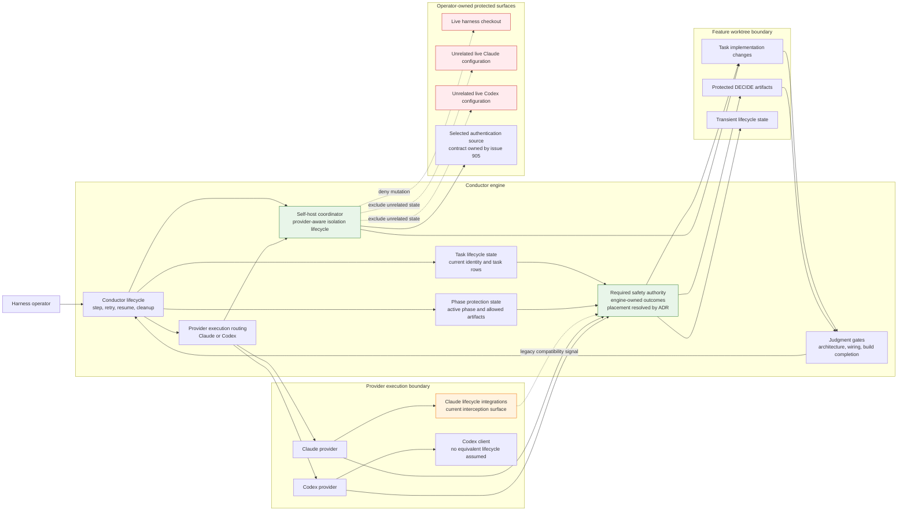

# Components: Codex Safety and Self-Host Parity (#907)

**Last updated:** 2026-07-25
**Scope:** The current Claude-shaped safety surfaces, the provider-neutral engine seams
that already own lifecycle and judgment, and the required ownership boundary for task
identity, mutation protection, protected artifacts, and self-host isolation.

## Component Diagram

## Boundary Notes

- The conductor already owns step, retry, resume, phase, and cleanup lifecycles.
- Current-task and phase state already exist as engine-visible worktree state, while
  Claude lifecycle integrations currently perform key interception and stamping.
- The required safety authority owns outcomes, not provider API symmetry. Claude
  lifecycle integration may remain as a compatibility signal, but it is not the
  correctness boundary.
- Judgment gates remain the authority for architecture, wiring, and build completeness;
  current-task identity does not replace those judgments.
- Self-host isolation preserves only the authentication source selected by issue #905.
  The live checkout and unrelated provider configuration remain protected.
- Exact module placement and compatibility migration are decisions for architecture
  review; this diagram fixes ownership and trust boundaries without choosing that seam.

## Legend

- **Green** — required engine-owned safety and isolation outcomes for #907.
- **Orange** — current Claude-specific lifecycle integration retained as context, not
  as the target correctness boundary.
- **Red** — operator-owned surfaces a self-host run must not mutate.
- Solid arrows show control or permitted data flow; dotted arrows show compatibility,
  exclusion, or denied-mutation relationships.

## Change Log

| Date | Change | Reason |
|------|--------|--------|
| 2026-07-25 | Initial component boundary | DECIDE architecture for issue #907 |
