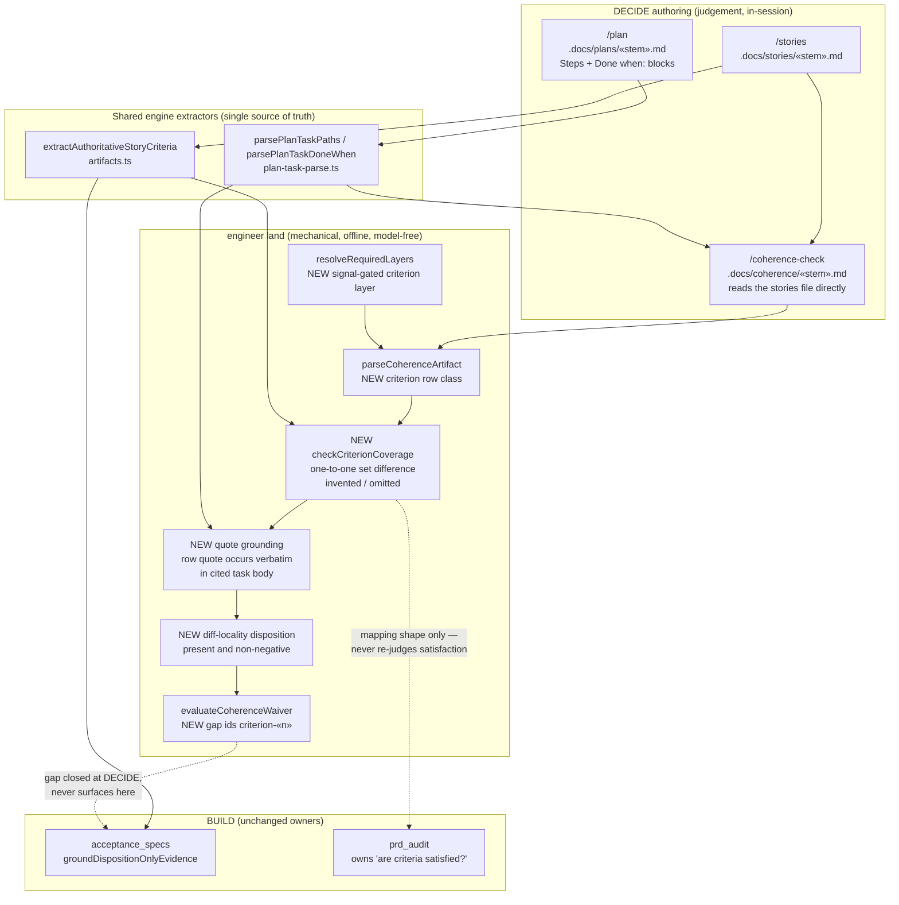

# Components: criterion-level coherence coverage

**Last updated:** 2026-08-23
**Scope:** The DECIDE-time and land-time surfaces changed by jstoup111/ai-conductor#1799 —
a new signal-gated `criterion` coherence row class, the shared per-criterion extractor now
consumed on both sides of the gate, and the mechanical grounding of each row's coverage claim.
Subsumes jstoup111/ai-conductor#1744.

## Diagram

## Legend

- `«…»` — variable placeholder (plan stem, criterion index).
- "NEW" marks surfaces introduced by this feature.
- The dotted edges are *non*-dependencies: they record ownership boundaries this design must not
  cross. `prd_audit` keeps sole ownership of "does the feature satisfy its criteria"
  (adr-2026-08-22-one-owner-per-review-question); the new layer only grades mapping shape.
- `extractAuthoritativeStoryCriteria` becoming a shared input is the load-bearing change: today
  `acceptance_specs` is its only caller, which is exactly why the two disagree.
- The skill enumerates criteria by reading the stories file, with no dedicated CLI primitive. An
  author who misses a criterion is not silently trusted: the land rung re-enumerates with the
  engine extractor and rejects, naming the omitted criterion. Fail-closed at land is the guarantee,
  not authoring-time completeness.
- Every NEW land-side box is pure code. No model runs at the landing boundary
  (adr-2026-07-22-coherence-gate-placement-and-validation-split).

## Change Log

| Date | Change | Reason |
|------|--------|--------|
| 2026-08-23 | Initial generation | DECIDE-phase design for intake #1799 |
| 2026-08-23 | Verified against the 24-task plan; no structural change | Plan-update pass (/plan step 8b) |
