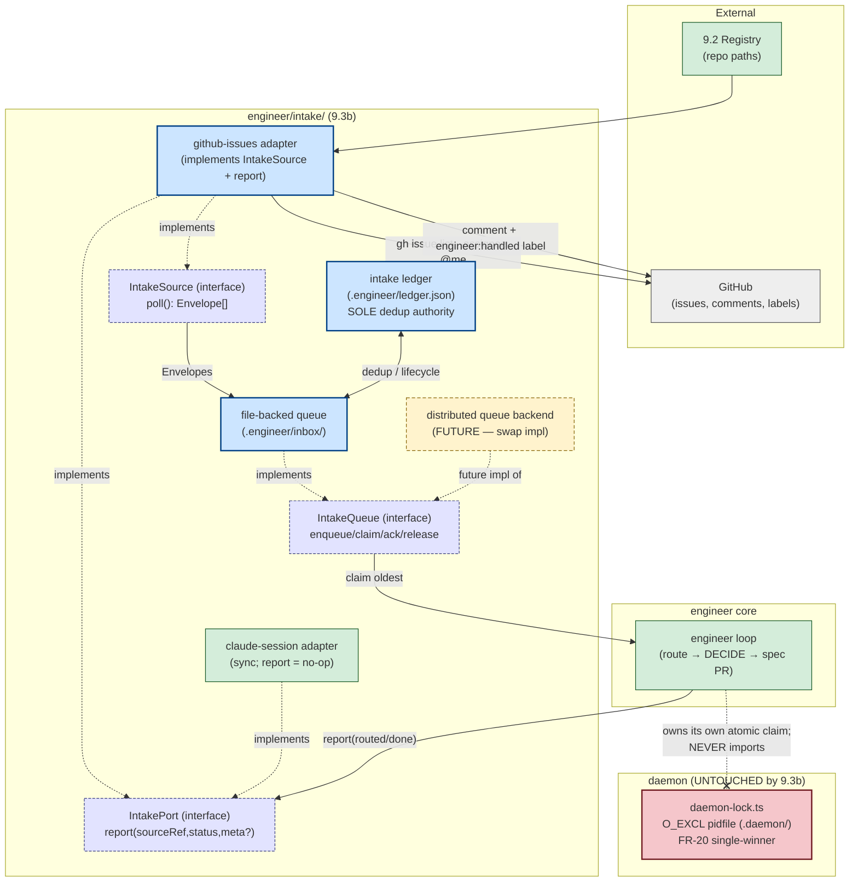

# Components (L3): Engineer Intake Subsystem — Phase 9.3b

**Last updated:** 2026-06-27
**Scope:** `src/conductor/src/engine/engineer/` intake path after 9.3b. Shows the new
github-issues source, async inbox queue, durable ledger, and realized write-back — and the
deliberately **untouched** daemon lock boundary.

## Diagram

## Legend

- **Blue (new, 9.3b):** github-issues adapter, file-backed queue, durable ledger.
- **Dashed lilac (interface):** the seams the core depends on — `IntakeSource`, `IntakePort`,
  `IntakeQueue`. Loose coupling: core imports interfaces only.
- **Green (existing):** claude-session adapter, engineer loop, 9.2 registry — reused, minimally
  extended (loop gains poll-on-launch + report wiring; `report` signature widened with optional `meta`).
- **Red (frozen):** `daemon-lock.ts` / `O_EXCL` pidfile. **9.3b must not touch it.** The `⊗` edge
  marks that the queue's atomic claim is implemented with its *own* primitive and never imports the
  daemon lock (FR-20 untouched).
- **Yellow dashed (future):** distributed queue backend — a drop-in implementation of `IntakeQueue`
  for a future worker pool. Not built in 9.3b.

## Key invariants encoded

1. `engineer/intake/idempotency.ts` (9.3 in-memory guard) is **removed**; the ledger is the single
   dedup authority. (Not shown as a node — it no longer exists post-9.3b.)
2. `.engineer/` (intake) and `.daemon/` (build/liveness) are disjoint directories.
3. The github adapter is the only component that talks to GitHub (capture + write-back); the core
   speaks only to interfaces.

## Change Log

| Date | Change | Reason |
|------|--------|--------|
| 2026-06-27 | Initial generation | Phase 9.3b intake subsystem design |
