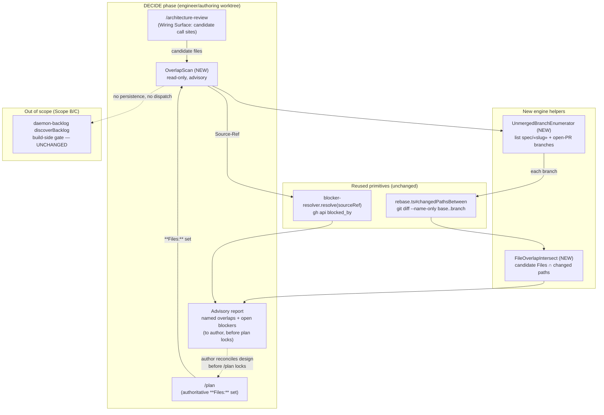

# Components: DECIDE-time unmerged-overlap scan (#523, Scope A)

**Last updated:** 2026-07-21
**Scope:** The new read-only overlap-surfacing component invoked during DECIDE
(`/architecture-review` + `/plan`). Build side (`daemon-backlog`) is untouched and shown only
as an out-of-scope boundary for contrast.

## Diagram

## Legend

- **NEW** nodes are the only production code this spec adds: an unmerged-branch enumerator, a
  file-overlap intersection, and the `OverlapScan` orchestrator that wires them to two reused
  primitives.
- **Reused** nodes already exist: `rebase.ts#changedPathsBetween` (git diff) and
  `blocker-resolver.resolve` (GitHub `blocked_by` API). This spec calls them; it does not
  modify them.
- **Out of scope** — `daemon-backlog` is drawn only to make the boundary explicit: the scan
  writes nothing and never touches build dispatch. The dotted "no persistence, no dispatch"
  edge is a *non*-interaction.
- `«slug»` is a placeholder for a per-idea branch slug.

## Change Log

| Date | Change | Reason |
|------|--------|--------|
| 2026-07-21 | Initial generation | Created during DECIDE for #523 Scope A |
