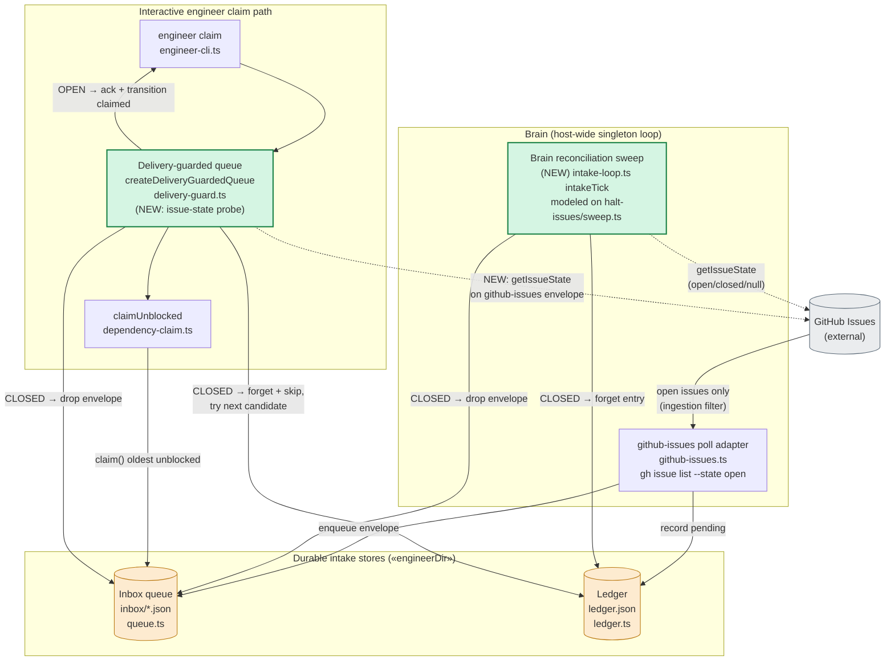

# Components: engineer intake subsystem — closed-issue guard + brain sweep

**Last updated:** 2026-07-22
**Scope:** The engineer intake path (poll → durable inbox + ledger → claim) and the two
new closed-issue control points. Scoped to the intake subsystem only, not the whole harness.

## Diagram

## Legend

- **Green nodes** — new/changed behavior introduced by this feature: the issue-state probe
  inside `createDeliveryGuardedQueue`, and the new brain reconciliation sweep.
- **Orange nodes** — the two durable stores under `«engineerDir»` (default
  `~/.ai-conductor/engineer`): the inbox queue directory and `ledger.json`.
- **Solid arrows** — writes/reads to the durable stores or command flow.
- **Dotted arrows** — live GitHub reads (`GhAbstraction.getIssueState`).
- **`--state open`** on the poll adapter gates **ingestion only** — a closed issue is never
  newly captured, but this does nothing for an issue captured while open and closed later.
  The two green control points close that gap: the guard cleans/skips **at dequeue**, the
  sweep cleans **periodically**.
- **Disposition = forget:** a closed pending entry is removed (`ledger.forget`) and its inbox
  envelope dropped; a later reopen is re-ingested fresh by the `--state open` poll.

## Change Log

| Date | Change | Reason |
|------|--------|--------|
| 2026-07-22 | Initial generation | Added intake closed-issue guard + brain sweep (spec DECIDE, tier M) |
