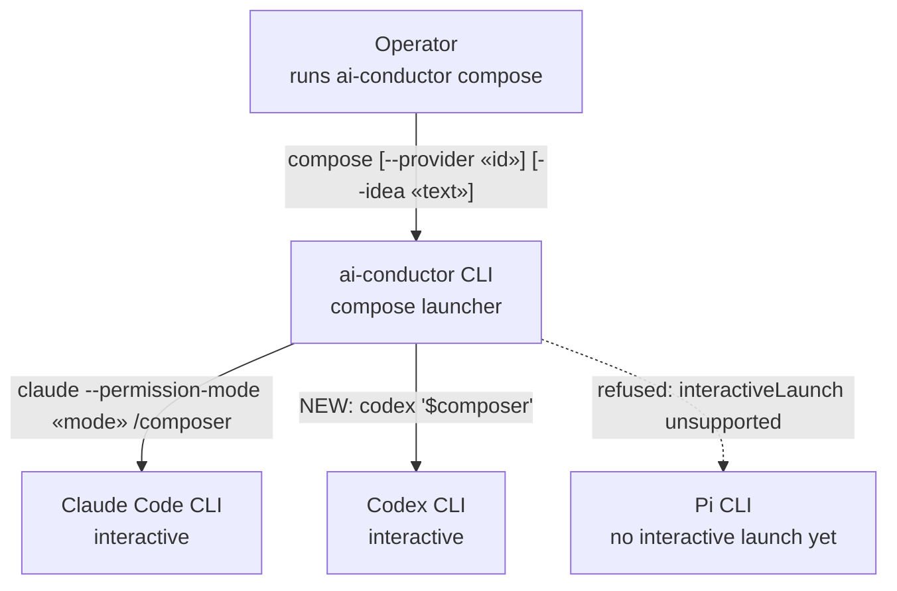
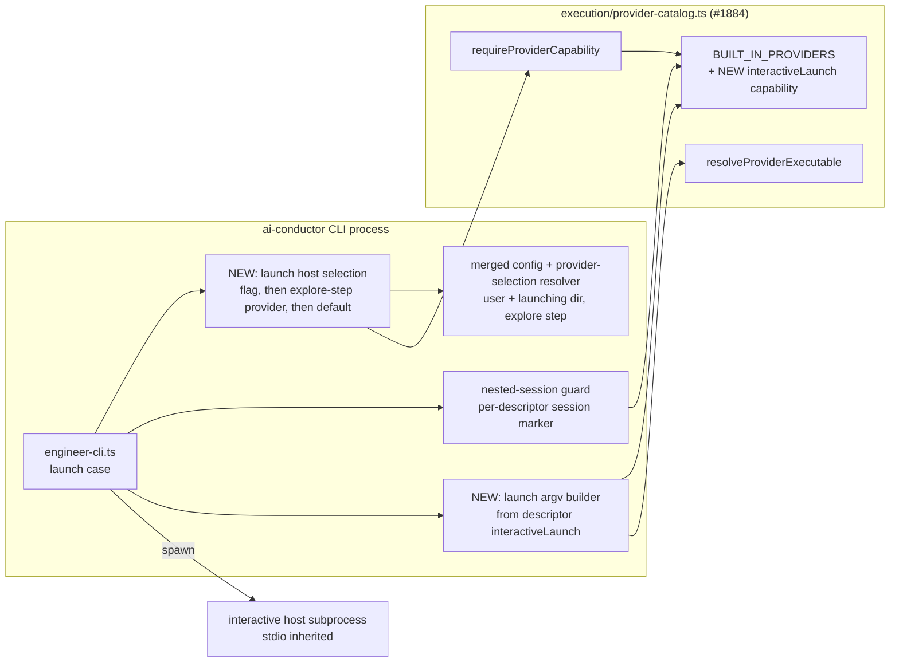
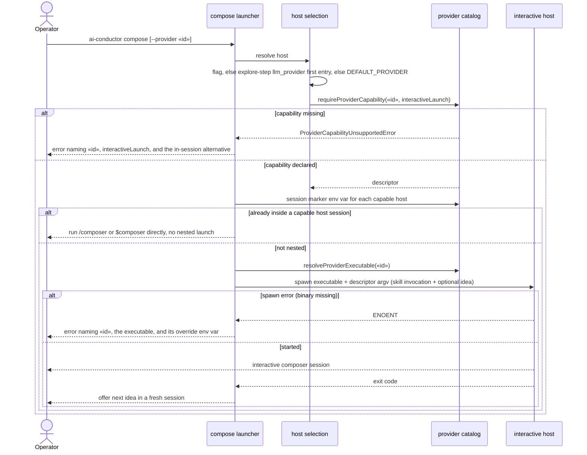

# Architecture: Compose launcher honors llm_provider for Codex (#1007)

**Last updated:** 2026-09-28
**Scope:** How the bare `ai-conductor compose` launcher picks the interactive host it starts. Today
it always spawns `claude /composer`. After this change it selects a host from the built-in provider
catalog (#1884) through a new `interactiveLaunch` descriptor capability. Codex operators get
`codex '$composer'`, and a host without the capability is refused by name.

## Current state (grounding)

- `engine/engineer-cli.ts` `launchClaudeEngineer` spawns the literal `claude` binary with
  `engineerLaunchArgs` (`--permission-mode <mode>` + `/composer [idea]`). It never reads `llm_provider`.
- The `launch` case of the same file refuses to nest when `CLAUDECODE` is set, and only then.
  Nothing detects the case where the operator is already inside a Codex session.
- A spawn error (binary not on `PATH`) rejects to the caller with no message that names the
  requirement.
- `skills/composer/SKILL.md` calls the launcher "Claude-only" and defers other hosts to #759, which is
  closed.
- #1884 (in flight) adds `execution/provider-catalog.ts` (`BUILT_IN_PROVIDERS`, capability flags with
  fail-closed defaults, `resolveProviderExecutable`, `requireProviderCapability`), and a structural test
  that forbids provider-id literals outside the catalog and adapter modules. This feature builds on it.

## System Context (L1)

## Components (L3)

## Sequence: bare `ai-conductor compose` launch

## Legend

- **NEW** marks a component or edge this feature adds. Everything else exists on `main` or arrives with
  #1884.
- `interactiveLaunch` is a catalog capability flag with the #1884 fail-closed default: a descriptor that
  omits it is unsupported. It carries the host's argv shape (permission posture, skill invocation
  prefix, idea placement) and the env var that marks an existing session of that host.
- The dashed edge is a refusal, not a call.
- `«id»` is a catalog provider id and `«mode»` is the permission mode from
  `CONDUCT_ENGINEER_PERMISSION_MODE`.

## Change Log

| Date | Change | Reason |
|------|--------|--------|
| 2026-09-28 | Initial generation | #1007 DECIDE: compose launcher host selection via the provider catalog |
| 2026-09-28 | Host source is the `explore` step's resolved provider | Conflict check: a run-level ladder that prefers codex would override DECIDE steps pinned to claude |
