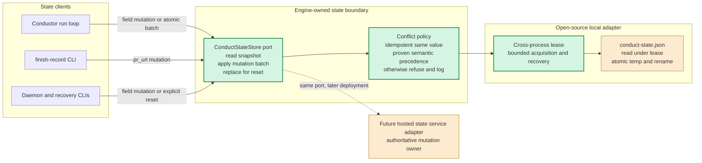
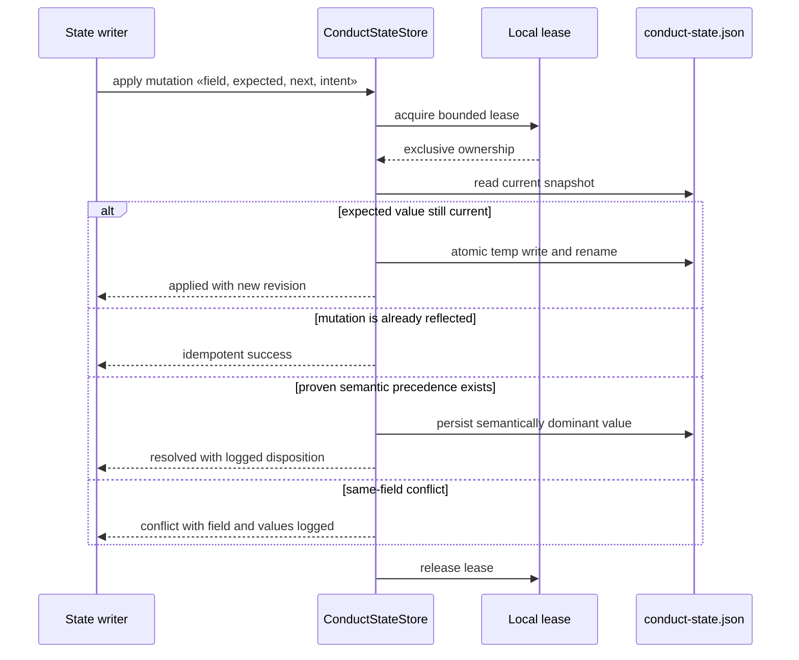

# Components: conduct-state mutation ownership

**Last updated:** 2026-08-01
**Scope:** Proposed state mutation boundary for conductor and out-of-process CLI writers.

## Diagram

## Mutation Sequence

## Legend

- Green components are the new engine-owned mutation boundary and serialized local implementation.
- The ordinary command changes one field. A batch is permitted only when several fields form one invariant and must commit together.
- `replace` is a distinct privileged operation used by deliberate reset/start-over paths; omission never means deletion.
- Semantic precedence is field-specific and exhaustive. `feature_status: complete` is terminal; step `done` is not generally dominant because explicit invalidation may change it to `stale`.
- The future hosted adapter is out of scope. It replaces the local adapter behind the same port rather than changing state clients.

## Change Log

| Date | Change | Reason |
|---|---|---|
| 2026-08-01 | Initial proposed architecture | Prevent lost updates and establish the adapter boundary for a future state authority |
| 2026-08-01 | Confirmed against the 18-task implementation plan | Kept mutation, conflict, lease, persistence, reset, and adapter wiring aligned with the approved task sequence |
