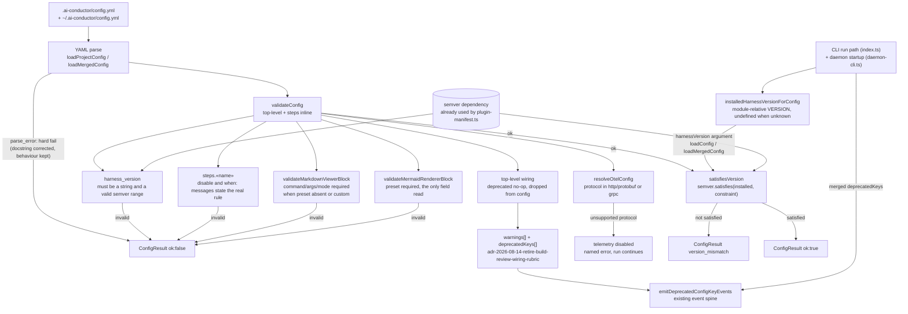
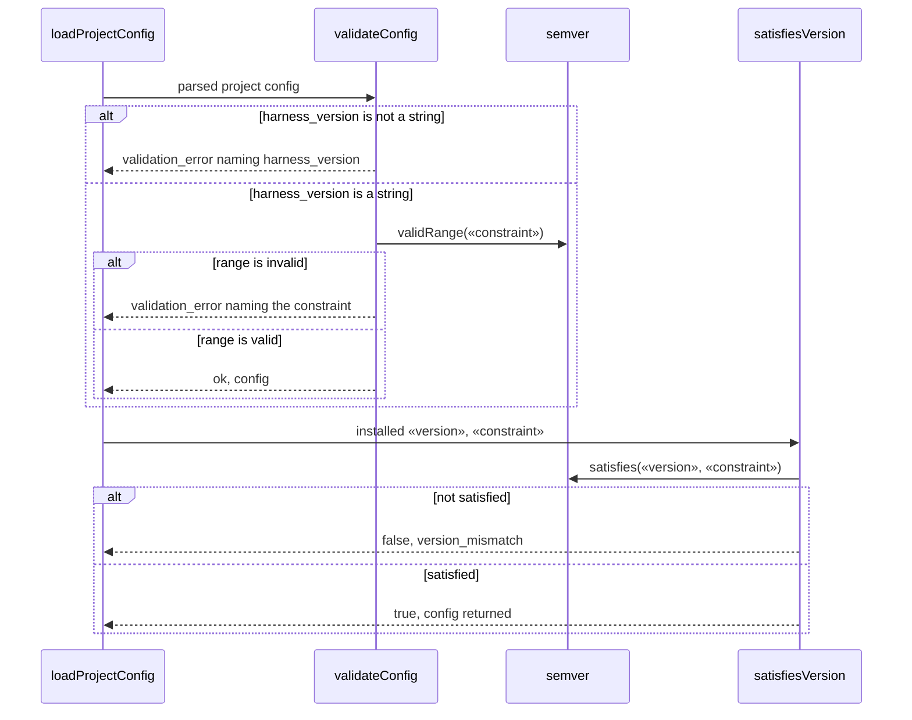

# Components: Config validation gaps (issue #1026)

**Last updated:** 2026-09-28
**Scope:** where each of the seven #1026 validation fixes sits in the config load path —
`validateConfig` and its per-block helpers, the post-validation `harness_version` gate in
`loadProjectConfig`, and the existing warning / deprecated-key channels the fixes reuse.

## Components

## Diagram — harness_version gate

## Legend

- «constraint» — the project's `harness_version` value; caret, tilde, hyphen range, comparator
  sets and exact versions are all evaluated by `semver`, none silently pass.
- «version» — the installed harness version read from the repository `VERSION` file.
- Solid edges into `ConfigResult ok:false` are validation failures introduced or tightened by this
  change; each names the offending key.
- The `wiring` path does not fail: it reuses the same warning + `deprecatedKeys` channel that
  retired `build_review` keys already use, so the deprecation is visible on the event spine and no
  consumer config breaks.
- No new module, persistence, or external dependency is added; every box is an existing function
  in `src/conductor/src/engine/config.ts` except `resolveOtelConfig`
  (`src/conductor/src/engine/otel/otel-config.ts`) and `semver` (existing dependency).

> **Amended 2026-09-28 by #1026:** conflict-check withdrew the `when` + `parallel` rejection (ADR `004-when-parallel-workflow-dsl` supports it) and moved the `otel.protocol` check to `resolveOtelConfig`, which disables telemetry rather than failing config load.

## Change Log

| Date | Change | Reason |
|------|--------|--------|
| 2026-09-28 | Initial generation | DECIDE for issue #1026 (spec authoring) |
| 2026-09-28 | Removed when+parallel rejection; otel.protocol moved to resolveOtelConfig | Conflict-check resolutions (ADR 004; otel-observability stories) |
