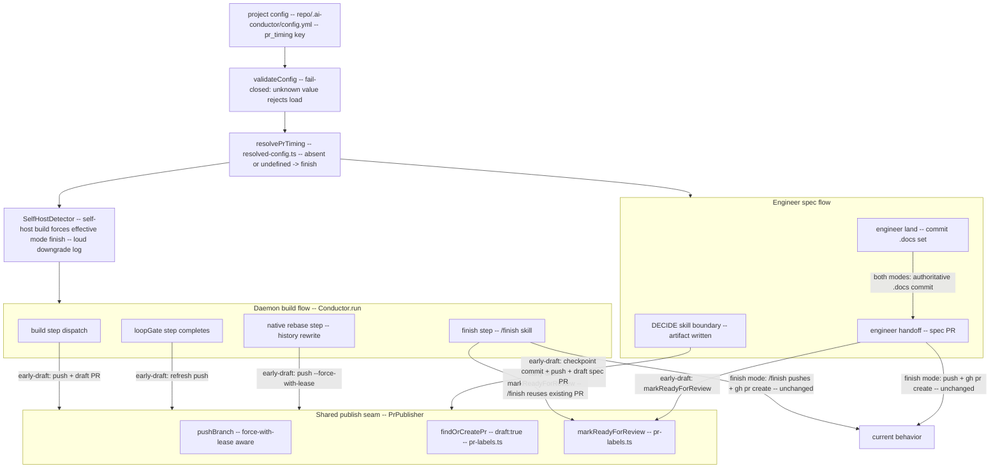

# Architecture: Configurable push/PR timing

**Last updated:** 2026-07-03
**Scope:** One config key, `pr_timing: finish | early-draft` (default `finish`), governing
WHEN a branch is pushed and its PR opened in BOTH publish flows: the daemon's implementation
build and the engineer's spec authoring. `finish` is byte-for-byte today's behavior.

## Component view — config resolution and the two publish flows

## Structural invariants

1. **Default is inert.** `pr_timing` absent or `finish` → zero behavior change in both
   flows; the `/finish` prompt augmentation and `engineer handoff` publish exactly as today.
2. **Fail-closed validation.** An unrecognized `pr_timing` value rejects config load
   (owner-gate `owner_gate_cutover` precedent) — a typo must never silently pick a mode.
3. **One resolver, two consumers.** Timing is resolved once (`resolvePrTiming`,
   `resolved-config.ts` pattern) and read via `Conductor.config` / the engineer command
   context; neither flow re-reads the file mid-run.
4. **Publishing reuses the escalation seam.** Early pushes and draft PRs go through the
   existing `findOrCreatePr({draft})` / push code paths (`pr-labels.ts`,
   `build-failure-escalation.ts` pattern) — no second gh-invocation implementation.
5. **History rewrite is contained.** Only the post-rebase refresh may force-push, and only
   `--force-with-lease`; every other push is a plain fast-forward push.
6. **`land` stays authoritative.** Engineer early-draft checkpoint commits never replace
   the `land` gate: artifact guards (C2, DRAFT-ADR, tier match) still run at `land`, and
   the spec PR is marked ready only at `handoff`.
7. **Advisory, never blocking.** A failed early push / draft-PR creation logs loudly and
   the build/authoring continues; only the finish-time publish remains load-bearing.

## Change Log

| Date | Change | Reason |
|------|--------|--------|
| 2026-07-03 | Initial generation | DECIDE for configurable-pr-timing (ai-conductor#199) |
| 2026-07-03 | Added SelfHostDetector downgrade on the daemon path | Conflict-check resolution (adr-2026-07-03-pr-timing-self-host-precedence) |
