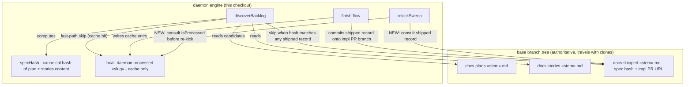
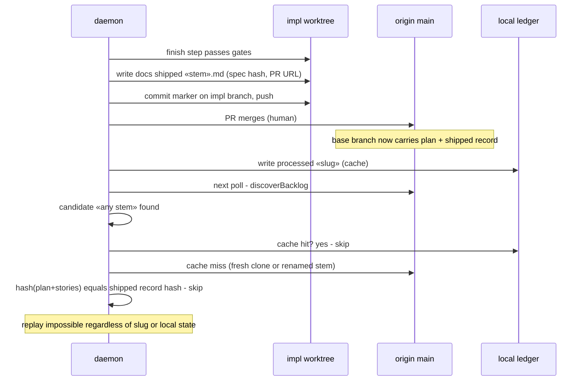

# Architecture: content-aware shipped-work dedup

**Last updated:** 2026-07-03
**Scope:** the three engine seams changed by this feature — finish-time shipped-record
authoring, discovery-time content-hash dedup, and rekick-time processed check — plus the
demotion of the local ledger to a cache.

## Components

## Sequence: ship → never re-dispatch

## Legend

- **shipped record** — `.docs/shipped/«stem».md`, committed onto the implementation PR
  branch by the finish flow, so the human merge that lands the code also lands the
  "this spec shipped" fact.
- **specHash** — canonical content hash over the spec's plan + stories files as read
  from the base branch tree; slug-independent, so a renamed stem still matches.
- **cache only** — `.daemon/processed/«slug»` keeps its fast-path role but is never
  the last line of defense; absence of a cache entry falls through to the shipped
  record check instead of dispatching.
- **NEW** edges — behavior added by this feature; all other edges exist today.

## Change Log

| Date | Change | Reason |
|------|--------|--------|
| 2026-07-03 | Initial generation | Spec authoring for #204/#205 (engineer DECIDE) |
| 2026-07-03 | Plan-update pass: confirmed diagrams match the implementation plan (shipped-record module, dedup-before-owner-gate, rekick guard) | /plan step 8b |
