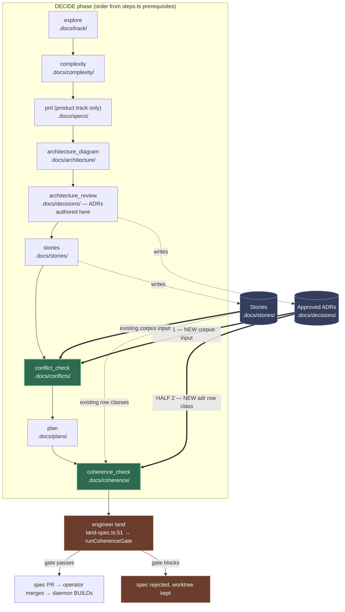
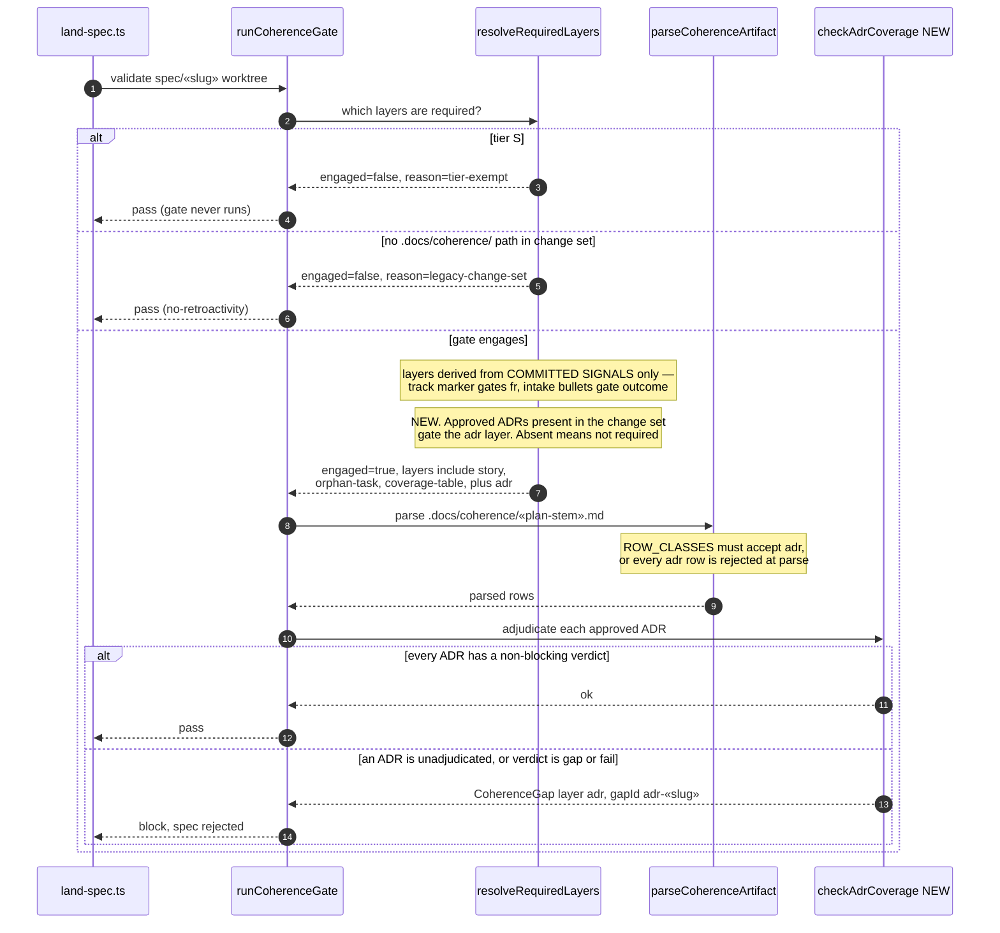

# Architecture: ADR contradiction detection across DECIDE

**Last updated:** 2026-08-09
**Scope:** Where an approved-ADR-versus-story contradiction is detected and enforced across
the DECIDE pipeline, and how the land-time coherence gate engages the new `adr` layer without
breaking specs authored before it shipped.
**Tier:** M — technical track. Source: intake #1391.

## Problem in one line

`skills/conflict-check/SKILL.md` §1 loads `.docs/stories/`, `.docs/specs/`, `.docs/conflicts/`
— never `.docs/decisions/`. `skills/coherence-check/SKILL.md` has zero ADR mentions and four row
classes. So an approved ADR contradicting a story is invisible to both DECIDE gates, and surfaces
mid-BUILD as a needs-human halt.

## Diagram 1 — DECIDE pipeline: where each half intercepts

**Why both halves, and not either alone.** `conflict_check` runs *after* `architecture_review`,
so approved ADRs already exist on disk when it runs — that is what makes HALF 1 feasible, and it
places the report **before the plan is approved**, which is what intake #1391's first desired
outcome literally asks for. But skill prose alone is unenforceable: a skipped ADR pass is
indistinguishable from a clean one. `coherence_check` runs *after* `plan`, so HALF 2 alone would
report post-plan — still inside DECIDE, still before BUILD, but later than asked. HALF 2 is what
makes the adjudication *provable* at land time.

## Diagram 2 — Land-time gate: engaging the `adr` layer compatibly

## The backward-compatibility answer

The constraint: `docs/explanation/gates.md:182` documents a retroactivity escape for a change set
carrying **no** coherence artifact. It does **not** cover an *existing* artifact that simply has no
`adr` rows — which is every coherence artifact authored before this ships.

**No new escape hatch is needed.** `coherence-validator.ts` already solves this class of problem
with `CoherenceRequiredLayer` / `resolveRequiredLayers`, which derives required layers **from
committed signals only**:

| Layer | Existing gating signal |
|---|---|
| `fr` | no track marker or an explicit `product` marker requires it; `technical` skips it |
| `outcome` | any persisted intake outcome bullets require it; none skips it |
| `story`, `orphan-task`, `coverage-table` | structural — always required once engaged |

The `adr` layer joins the **signal-gated** group, not the structural one: it is required **iff the
spec's change set carries approved ADRs under `.docs/decisions/`**. This is the same shape as the
track marker and the outcome bullets, so it inherits their compatibility properties for free —
a spec with no ADRs never has the layer required, and a tier-S or legacy spec never reaches the
check at all.

## Component impact

| Surface | Change | Note |
|---|---|---|
| `skills/conflict-check/SKILL.md` | §1 Inventory gains `.docs/decisions/`; ADR-vs-story becomes a comparison party | ADRs currently appear only as an *output* and a kickback target |
| `skills/coherence-check/SKILL.md` | `adr` row class; ADR pairs added to the §4d consistency pass | file currently has zero ADR mentions |
| `coherence-validator.ts` `CoherenceRowClass` (:30) | add `adr` | |
| `coherence-validator.ts` `ROW_CLASSES` (:51) | add `adr` | **:130 rejects unknown classes at parse** — skill and engine must ship together |
| `coherence-validator.ts` `CoherenceGapLayer` + `GAP_LAYER_ORDER` (:884) | add `adr` in fixed report order | 7 layers today |
| `coherence-validator.ts` `CoherenceRequiredLayer` (:1215) | add `adr`; derive from committed ADR presence | 5 layers today |
| `coherence-validator.ts` | new `checkAdrCoverage` + pool derivation from `.docs/decisions/` | siblings at :325, :389, :503, :601, :735 |
| `docs/reference/skills.md` | both skill entries | Documentation Upkeep rule |
| `docs/explanation/gates.md` | coherence gate layer description (:145, :182–194) | #1394 skipped this; it changed no engine behavior — we do |

## Deliberately out of scope

- **BUILD-time amendment route** — intake #1391's fifth outcome, split to **#1411** at the
  operator's direction. Different mechanism, adjacent open tickets #1366 and #1258.
- **Story-versus-PRD tie-out** — already delivered by #1401 (`coherence-check` §4e). Not
  re-architected here.
- **Contradiction *vocabulary*** — already delivered by #1394 (oscillating conflict type; `fail`
  verdict; §4d cross-layer pass, merged 2026-08-08). This change supplies the missing **corpus**,
  and builds on that vocabulary rather than duplicating it.

## Legend

- **Bold arrows** in Diagram 1 mark the two new data flows this change introduces.
- Cylinders are committed artifact directories; rectangles are DECIDE steps or engine seams.
- Guillemets («slug», «plan-stem») denote variable path segments.

## Change Log

| Date | Change | Reason |
|------|--------|--------|
| 2026-08-09 | Initial generation | DECIDE for intake #1391 |
