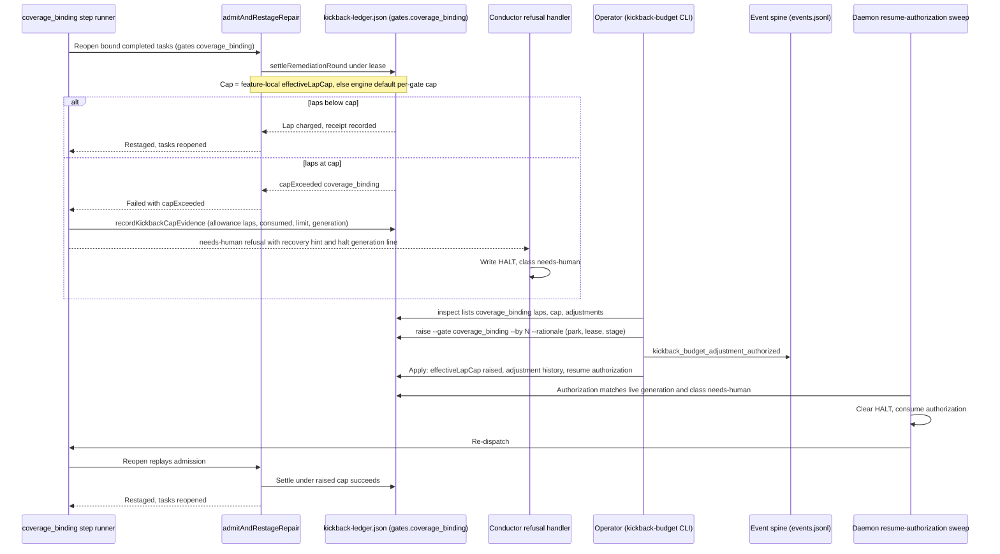

# Sequence: coverage_binding lap-cap halt recovered through kickback-budget

**Last updated:** 2026-10-10
**Scope:** The coverage_binding existing-task reopen path, its lap-cap halt, and its recovery through the existing operator `kickback-budget` command family and daemon resume-authorization sweep (#2846). No new component, store, halt class, or event type.

## Diagram

## Legend

- `gates.coverage_binding` is the existing ledger key the coverage_binding reopen already charges (adr-2026-09-06-reopened-task-resolution decision 10).
- The single lap-counted-gate predicate decides, for staging, apply, inspect, and the CLI, that `coverage_binding` is budgeted in `laps` and `effectiveLapCap` like `prd_audit` and `architecture_review_as_built`, not in `cumulative` and `effectiveLimit` like `build_review`.
- Every operator-side step is the existing #2190 / adr-2026-08-29 recovery mechanism, unchanged except that it now admits this gate.

## Change Log

| Date | Change | Reason |
|------|--------|--------|
| 2026-10-10 | Initial generation | DECIDE for #2846 |
