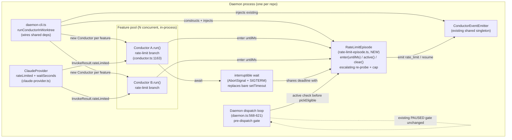
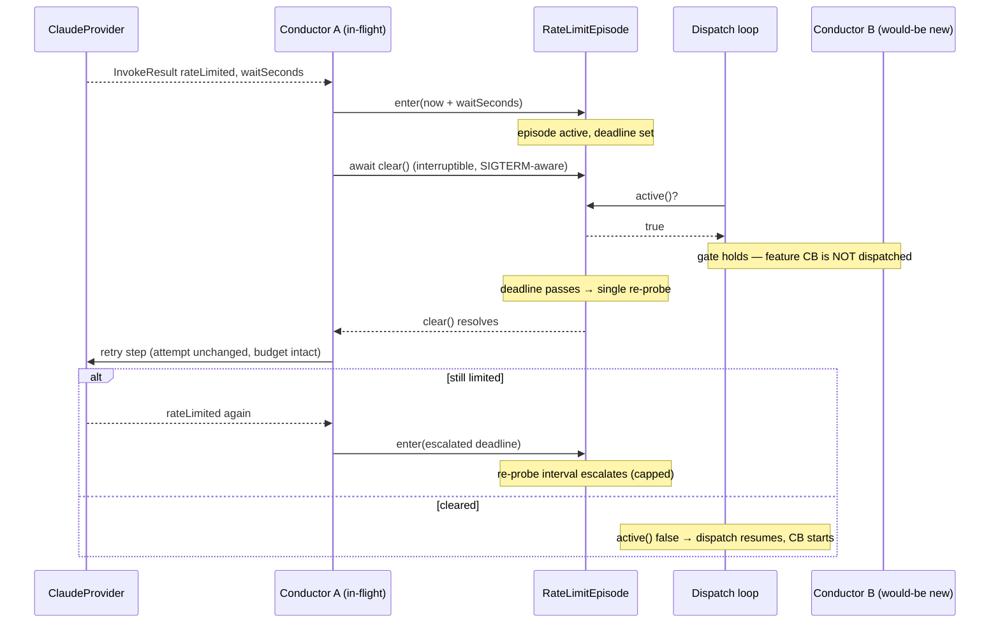

# Components & Sequence: Daemon rate-limit episode coordinator

**Last updated:** 2026-07-05
**Scope:** The in-process `RateLimitEpisode` coordinator and how it couples the per-feature
`Conductor` rate-limit branch to the daemon dispatch loop, plus the signal-responsive wait.
Source: jstoup111/ai-conductor#270.

## Component Diagram (L3)

## Sequence: episode onset, coordinated backoff, resume

## Legend

- **NEW** node = code introduced by this feature; all others exist today.
- `RateLimitEpisode` is a pure, timer-injected module (mirrors the existing `waker.ts` shape):
  no wall-clock reads inside, `now`/timer injected for tests.
- The dispatch-loop gate sits beside the existing `checkPaused()` gate (daemon.ts:574) and only
  suppresses *new* picks; in-flight features are untouched.
- The interruptible wait shares the episode deadline; a SIGTERM aborts it promptly (today's bare
  `setTimeout` at conductor.ts:1168 has no abort path and no SIGTERM handler).
- `«untilMs»`, `«waitSeconds»` are runtime values, not literals.

## Change Log

| Date | Change | Reason |
|------|--------|--------|
| 2026-07-05 | Initial generation | Feature design for daemon rate-limit episode (#270) |
