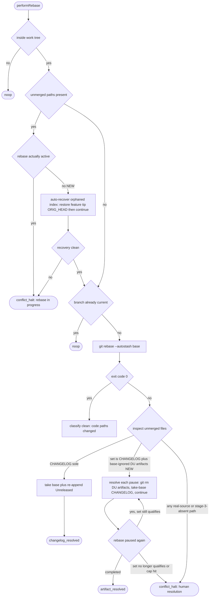

# Architecture: Daemon auto-resolve gitignored build-artifact rebase conflicts

Extends the engine-native `rebase` loopGate (`src/conductor/src/engine/rebase.ts`) with two
new autonomous conflict-resolution capabilities plus a dispatch-side re-route. Scope is one
engine module (`rebase.ts`) plus one dispatch-gate seam. Both `performRebase` call sites
(finish-time `runRebaseStep` and the re-kick play-forward path) consume the same outcome
model, so new resolution branches land in the shared helper and are exercised on both paths.

Source: jstoup111/ai-conductor#319.

## Component / flow diagram

The `performRebase` decision flow, with the two new branches (dashed) added to the existing
CHANGELOG-sole and HALT branches.

## Key seams and where new logic plugs in

- **New conflict branch — base-ignored delete/modify, composed with CHANGELOG, looping.** After
  the existing CHANGELOG-sole check in `performRebase` (`rebase.ts:~419`), add a resolver that, at
  each rebase pause, resolves a set partitioned into {`CHANGELOG.md`} ∪ {base-ignored deleted-by-us
  artifacts} and `git rebase --continue`s, repeating until the rebase completes (a `dist` artifact
  re-conflicts on each replayed commit). A qualifying artifact path is **deleted-by-us** —
  `git ls-files -u` shows stage 2 (base) absent, stage 3 (feature) present — AND base-ignored
  (below). Any path in NEITHER class, at any pause, disqualifies the whole set → HALT. Bounded by a
  max-iteration cap. Returns `artifact_resolved` (verdict-equivalent to `changelog_resolved`).
- **Base-ignored predicate.** `git check-ignore` reads the working tree, not a ref; at a paused
  rebase the working-tree `.gitignore` is base's with replayed feature commits layered on. So:
  disqualify the whole set if the branch modified ANY `.gitignore` vs base
  (`git diff --name-only <base>..HEAD`), else use native `git check-ignore -q` (which honors nested
  `.gitignore`/negation). Fail-closed on any ambiguity. The branch cannot launder a real file into
  "ignored".
- **Orphaned-index recovery.** In the preexisting-conflict guard (`rebase.ts:369-378`),
  split the two conditions: if `rebaseStateActive()` is TRUE, keep re-parking (a genuine
  in-progress rebase must never be reset). If it is FALSE but unmerged paths exist, that is
  an orphaned index from a prior aborted re-kick → restore the **feature tip** (`ORIG_HEAD` /
  branch ref, NOT `HEAD` — which may be detached at the base and would drop the feature commits and
  false-satisfy `isBranchCurrent`), clear the stale entries, and proceed into the normal flow.
- **Shared across both call sites.** Because the finish-time and re-kick paths both route
  through `performRebase` → `runGatedRebaseResolution`, the new branches are automatically
  exercised on both; no call-site-specific logic.
- **Dispatch-side re-route (gap #3).** A separate seam in the dispatch/skip decision: a
  `processed` slug whose only open PR carries the `needs-remediation` label gets one bounded,
  dedup-anchored re-dispatch so a torn-down finish-halt can self-resolve. This does NOT touch
  `rebase.ts`; it is specified as its own story and ADR-noted for its dedup safety boundary.

## Safety boundary (the load-bearing invariant)

Auto-resolution NEVER widens beyond **base-ignored build artifacts**. A delete/modify (or
any conflict) on a non-ignored path — real source, tests, config — always HALTs for a human.
The base-ignored predicate and the "all-or-nothing over the conflict set" rule are the two
guards that keep the resolver from silently dropping source. The orphaned-index recovery is
gated on `rebaseStateActive() === false` so it can never abort a live rebase.
