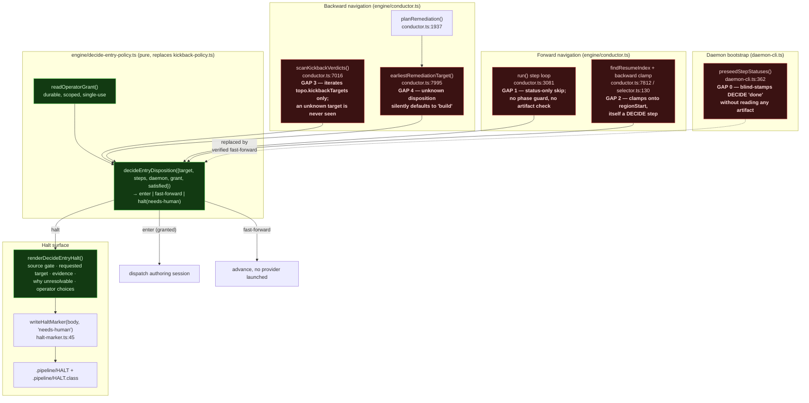
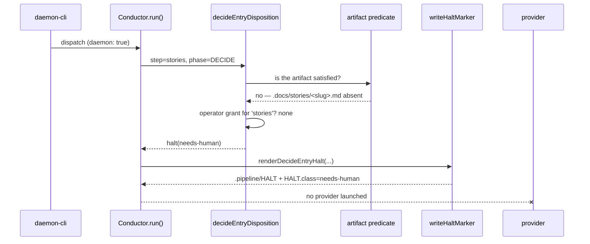

# Architecture: fail-closed DECIDE entry for autonomous runs (#550)

**Date:** 2026-08-03
**Stem:** daemon-autonomous-runs-must-fail-closed-on-any-amb
**Tier:** L (technical track)
**Issue:** jstoup111/ai-conductor#550

## Scope

Every seam at which an autonomous (`daemon: true`) conductor run can arrive at a DECIDE-phase
step — forward walk, verdict-aware resume clamp, verdict-driven kickback, and remediation
rewind — plus the daemon bootstrap that pre-stamps DECIDE status without reading an artifact.

Out of scope: interactive `/conduct` behavior (DECIDE authoring with a human present is
legitimate and unchanged), and the engineer loop's own DECIDE authoring.

## The invariant

> An autonomous run may **enter** DECIDE only when the operator has explicitly directed it.
> Anything else — an unsatisfied DECIDE step, an unknown or unresolvable target, a phase that
> cannot be established — fails closed with a `needs-human` HALT and launches no provider.
> A **healthy, already-satisfied** DECIDE artifact still fast-forwards with no dispatch.

Three words carry the weight: *enter* (dispatching an authoring session, or navigating the run
index onto a DECIDE step), *explicitly directed* (a durable operator grant, never inferred), and
*fails closed* (ambiguity resolves to HALT, never to `route`).

## Component view (C4 L3 — inside the conductor engine)

## Why one predicate, consulted everywhere

The #551 ADR established the pattern — one pure, I/O-free predicate consulted at every seam — and
proved its value: two seams had drifted apart because each carried its own inline check. This
change extends that predicate rather than adding a fifth guard, and widens it from two seams to
five. Phase is always resolved from the passed `StepDefinition[]`, never a hardcoded name list, so
a config-added custom DECIDE step is covered without an edit.

The decisive change is the **default**. Today `decideKickbackDisposition` returns `route` whenever
`steps.find(...)?.phase` is `undefined`. That is a fail-open default sitting at an authorization
boundary. The replacement returns `halt` on every branch it cannot positively prove safe.

## Sequence: unsatisfied DECIDE step under an autonomous run

The healthy path differs at one arrow: the artifact predicate answers *yes*, the policy returns
`fast-forward`, and the run advances with no provider launched and no added dispatch — the
negative-path cost requirement from the issue.

## Constraints this design must respect

1. **`needs-human` is the only correct class.** `rekickSweep` (`daemon-rekick.ts:173-193`) never
   auto-clears it. A guard whose HALT the daemon auto-clears is not a guard — the #551 ADR's
   reasoning applies unchanged here.
2. **The healthy fast-forward must stay cheap.** Satisfaction is answered by the existing
   `checkStepCompletion` artifact predicate, which discovery already runs; no new dispatch, no
   new provider session, no extra LLM call.
3. **Interactive runs are untouched.** Every branch is gated on `daemon === true`. Interactive
   `/conduct` continues to author DECIDE artifacts freely.
4. **Discovery's warn-skip is not a substitute.** `daemon-backlog.ts:755-806` `continue`s past a
   malformed spec and covers only plan/stories/coherence. It filters *which specs enter the
   backlog*; it cannot protect a run whose state is reconstructed mid-flight.
5. **The grant must be durable, scoped, and non-inferable.** It cannot be a process flag the
   daemon sets for itself, or the invariant is self-granting and worthless.
