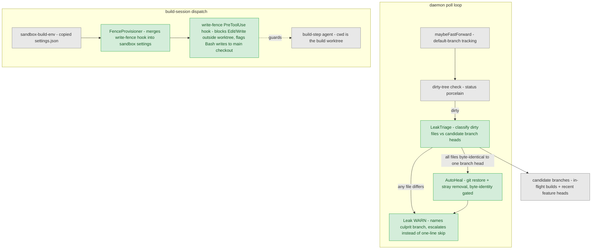
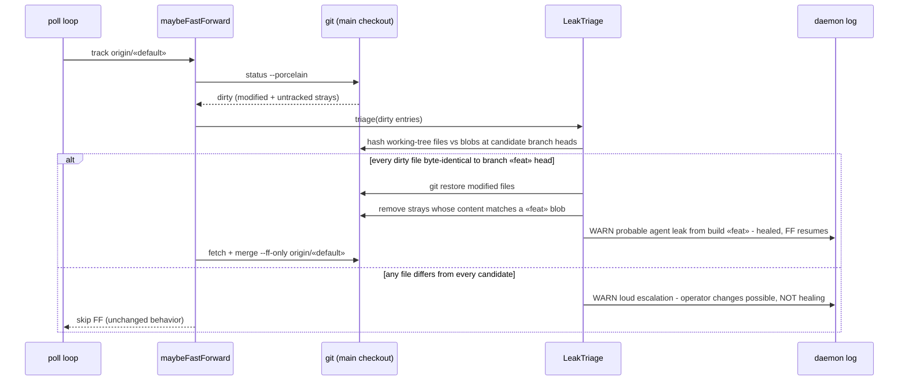
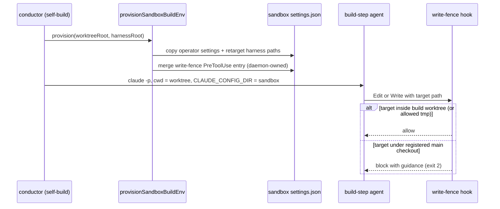

# Components + Sequences: Main-Checkout Leak Detection, Auto-Heal, and Write-Fence

**Last updated:** 2026-07-08
**Scope:** Where leak triage sits in the daemon's fast-forward path (`maybeFastForward` in
`daemon-backlog.ts`), the strict byte-identity gate that authorizes auto-heal, and the
prevention fence injected into build-session config via the sandbox settings provisioning
(`sandbox-build-env.ts`). Technical track — no PRD; issue jstoup111/ai-conductor#380.

## Component View

## Sequence: FF-skip leak triage + auto-heal

## Sequence: fence provisioning at build dispatch

## Legend

- Green = new components for #380; grey = existing.
- **LeakTriage / AutoHeal**: heal is authorized ONLY by byte-identity of every dirty
  tracked file against a single candidate branch head; stray untracked files are removed
  only when their content matches a blob on that same branch. Anything else keeps the
  existing skip behavior but escalates the log signal.
- **FenceProvisioner**: phase 2; rides the existing settings-copy seam in
  `sandbox-build-env.ts`, so self-builds get the fence without touching the operator's
  global config. Bash-write guarding is heuristic (flag/deny paths referencing the
  registered main checkout) and must never false-block worktree-internal commands.

## Change Log

| Date | Change | Reason |
|------|--------|--------|
| 2026-07-08 | Initial generation | DECIDE for issue #380 (engineer loop) |
