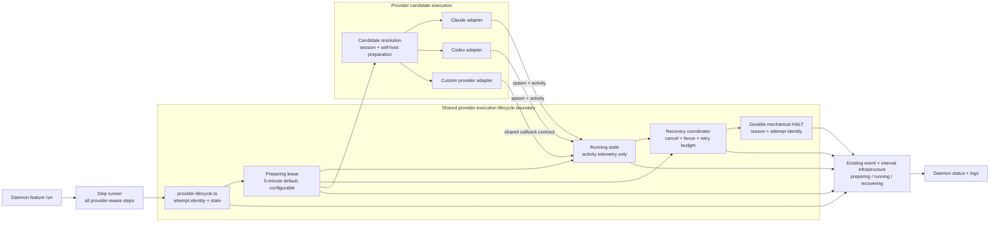
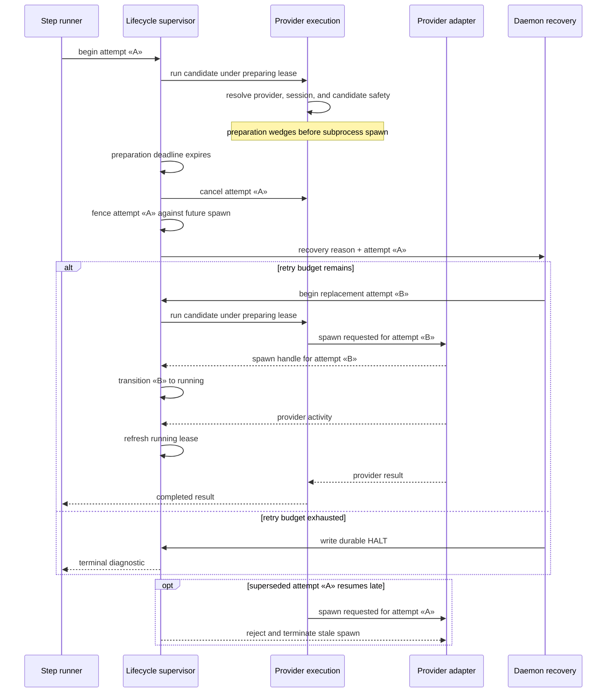

# Components and Sequence: Provider Lifecycle Supervision

**Last updated:** 2026-07-30
**Scope:** Bounded supervision from provider preparation through process activity, recovery, and durable halt for every daemon-managed provider step

## Component Diagram

## Sequence: Preparation Stall and Safe Replacement

## Architectural Boundaries

- The lifecycle supervisor owns timeout policy and attempt authority; provider adapters only expose spawn, activity, and termination capabilities.
    - Preparation begins before candidate resolution, session preparation, self-host preparation, or provider invocation, so every pre-spawn await is bounded.
- Attempt identity is checked synchronously through a provider-neutral spawn permit immediately before process creation. A superseded attempt cannot create a live worker after recovery starts.
- Once spawned, output activity is telemetry only. Silence cannot terminate or replace a live provider, and recovery never depends on discovering the process through operating-system inspection.
- Recovery uses a bounded budget and ends in a durable diagnostic halt rather than an unbounded redispatch loop.
- Lifecycle records are feature-scoped and drive both daemon status and logs without becoming completion authority.

## Legend

- Solid arrows show lifecycle ownership and provider execution flow.
- “Lease” means bounded liveness evidence, not a lock shared across features.
- Guillemets denote runtime identities.

## Change Log

| Date | Change | Reason |
|---|---|---|
| 2026-07-30 | Added concrete supervisor module, five-minute default, and existing event/interval reuse | Plan-update mode: reflect the approved 20-task dependency chain |
| 2026-07-30 | Initial feature architecture | Define the approved shared lifecycle-supervisor approach for issue #1141 |
