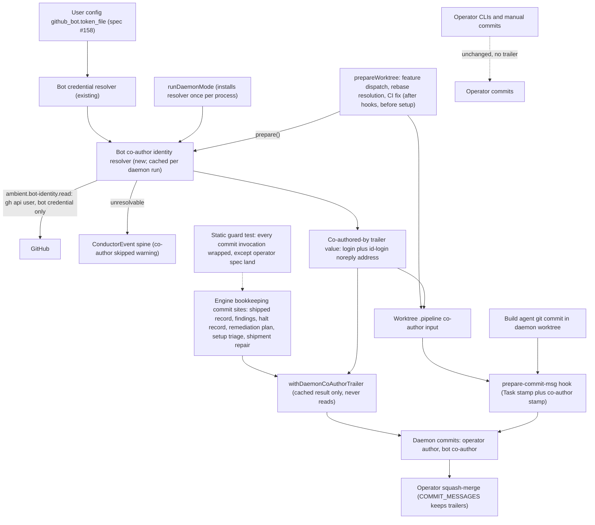
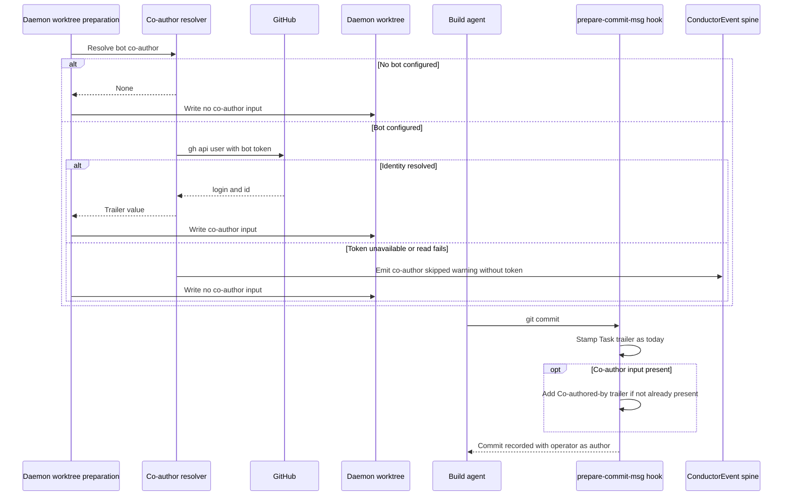
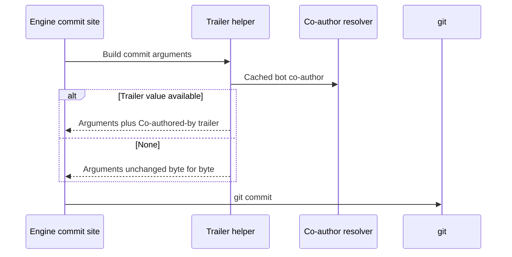

# Components and sequences: Daemon commits co-authored by the configured bot

**Last updated:** 2026-09-28
**Scope:** To-be commit attribution for daemon-created commits when a GitHub bot is configured,
for jstoup111/ai-conductor#2722. Feature: `daemon-commits-co-authored-by-the-configured-bot`.
Covers bot co-author identity resolution, the worktree prepare-commit-msg hook, and the engine
bookkeeping commit sites. Commit author/committer identity, operator CLIs, and manual commits are
shown only to mark them unchanged.

## Component diagram

## Sequence: build-agent commit in a daemon worktree

## Sequence: engine bookkeeping commit

## Legend

- **new** marks components this feature adds; everything else exists today.
- The trailer names the bot by its GitHub noreply address, the «id»+«login» form, so GitHub links
  the avatar. The token itself never leaves the resolver's child process.
- Dashed edges mark paths this feature deliberately leaves untouched.

## Change Log

| Date | Change | Reason |
|------|--------|--------|
| 2026-09-28 | Initial generation | DECIDE for #2722 |
| 2026-09-28 | Plan update: process-installed resolver, `ambient.bot-identity.read`, resolve and CI-fix worktrees, helper reads cache only, static guard | /plan for #2722 |
