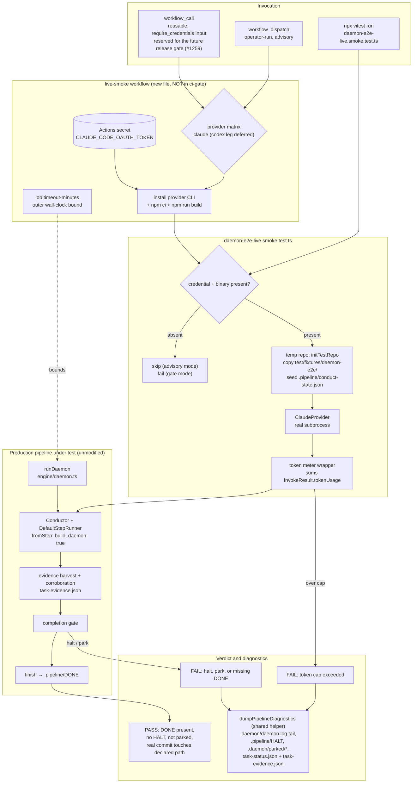

# Components: Live-agent daemon E2E smoke tier (#1124)

**Last updated:** 2026-08-02
**Scope:** A second, live-LLM tier over the deterministic daemon E2E fixture that shipped from #630
(PR #1155). Adds no production code — it reuses the shipped fixture, the real `runDaemon` loop, and
the real `Conductor`, swapping only the injected `LLMProvider` for a real provider adapter.

## Diagram

## Component notes

**What is new.** Only four things: the smoke test file, the token-meter fixture, one workflow file,
and two extra artifacts dumped by the existing diagnostics function at
`test/engine/daemon-e2e-fixture.test.ts:35`, which is exported so both tiers share one dump
implementation rather than diverging. No file under `src/conductor/src/` changes.

**The swap seam.** The deterministic tier already injects its provider by construction —
`new DefaultStepRunner(fake.provider, …)` at `daemon-e2e-fixture.test.ts:272-282`, handed to a real
`Conductor` inside `runDaemon`'s `runFeature`. The live tier substitutes a real `ClaudeProvider`
(`src/execution/claude-provider.ts:475`) at that same seam. The plugin registry
(`plugin-loader.ts:140`) is not involved, so no production selection logic changes. A second provider
leg would substitute `CodexProvider` (`src/execution/codex-provider.ts:154`) at the identical
argument — the seam is provider-agnostic, which is why deferring that leg costs no rework.

**The token meter.** A thin `LLMProvider` decorator wraps the real adapter, forwards `invoke` /
`invokeInteractive` unchanged, and accumulates `InvokeResult.tokenUsage`
(`src/execution/llm-provider.ts:168`). It is test-local: production metering already exists in
`engine/cost-rollup.ts` and is not touched.

**Two independent bounds.** The workflow's `timeout-minutes` bounds wall-clock even if a provider
hangs before returning; the in-test token cap bounds spend for a run that finishes inside the clock
but is unexpectedly chatty. Neither subsumes the other.

**Isolation from the required gate.** The file is named `*.smoke.test.ts`, which the existing
`vitest.config.ts:19` exclude glob keeps out of `npm test`, so the `conductor` job and therefore
`ci-gate` (`ci.yml:131`) never run it. The new workflow is a separate file with no `pull_request`
trigger and is absent from `ci-gate`'s `needs` list, so it cannot block a merge.

**Assertion shape differs from the deterministic tier.** A real agent's output is nondeterministic,
so the live tier asserts terminal *outcomes* (a `DONE` marker, no `HALT`, no park marker, a commit
whose diff touches the plan's declared path) rather than the deterministic tier's exact
`providerCalls: 3` and byte-exact commit body (`daemon-e2e-fixture.test.ts:346-357`).
