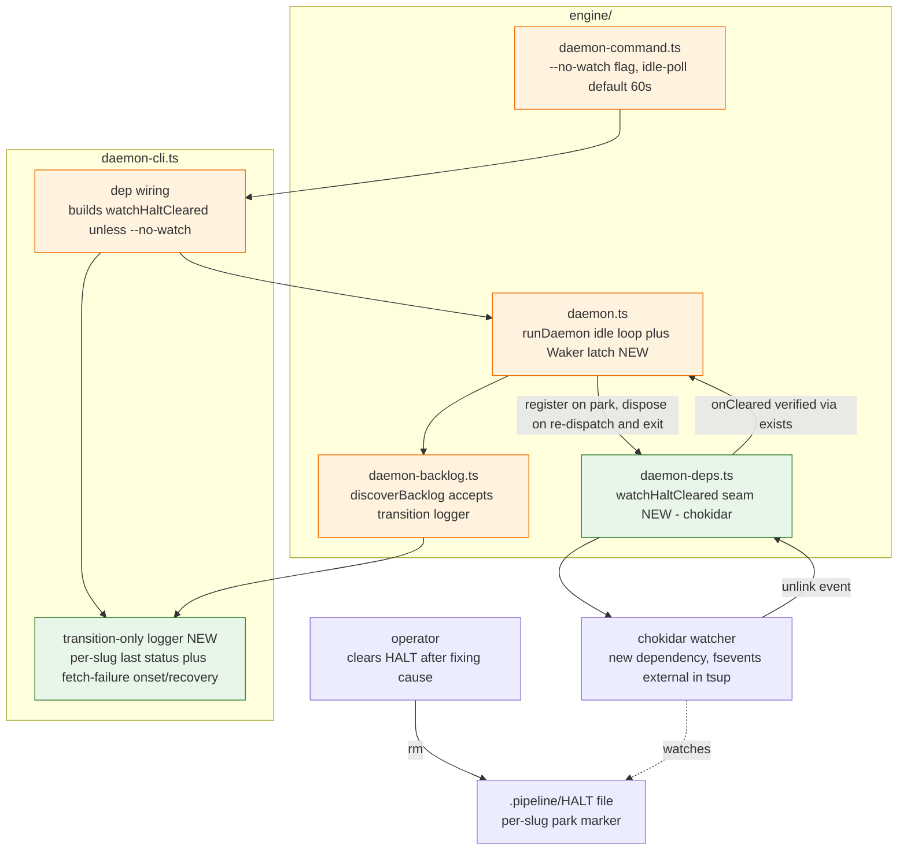
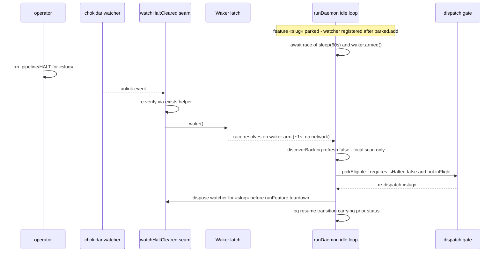
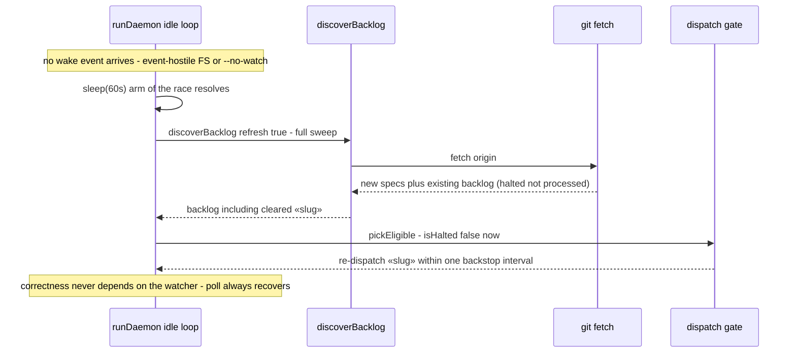

# Components + Sequences: Daemon Event-Driven Wake for Parked (HALTED) Features

**Last updated:** 2026-07-04
**Scope:** Event-driven unpark of HALTED features in the conductor daemon — chokidar
`watchHaltCleared` seam, latched single-shot Waker racing the injected idle sleep, per-slug
watcher lifecycle, 60s poll backstop shared with new-spec discovery, `--no-watch` escape
hatch, and transition-only logging (issue jstoup111/ai-conductor#111).

## Component Diagram

## Sequence: event-driven unpark (fast path)

## Sequence: backstop path (watcher missed or --no-watch)

## Legend

- **Green** — new modules/surfaces (`watchHaltCleared` seam, Waker latch, transition-only logger).
- **Orange** — modified existing modules.
- The watcher is an **optimization, never dispatch authority**: `isHalted()` plus the
  `inFlight`/`started`/`parked` sets remain the sole re-dispatch gate. A missed, duplicate, or
  spurious event costs at most one extra no-op loop iteration.
- Wake arm = cheap local scan (`refresh:false`, no network). Timeout arm = periodic full
  `git fetch` sweep — one timer serves both HALT-clear backstop and new-spec discovery.
- `--no-watch --idle-poll 5` restores today's pure-polling responsiveness on event-hostile
  filesystems.

## Change Log

| Date | Change | Reason |
|------|--------|--------|
| 2026-07-04 | Initial generation | DECIDE phase for intake #111 (engineer loop) |
