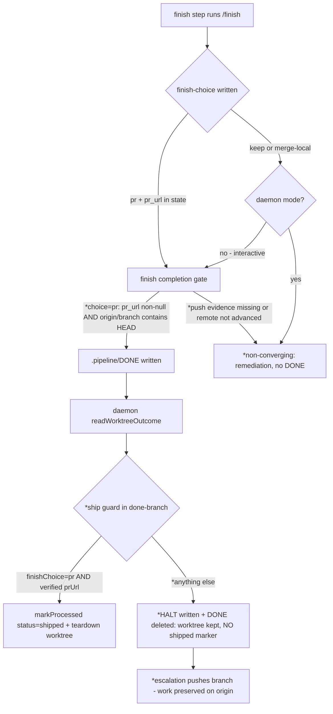
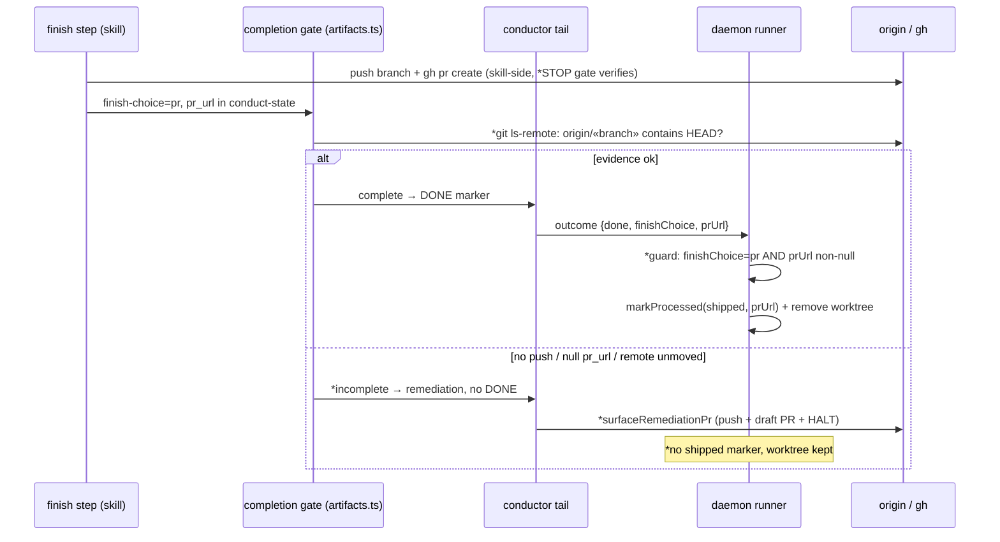

# Architecture: daemon false-ship guard (ai-conductor#337)

Finish→DONE→ship flow after this change. New elements marked with `*`.

The two guards are independent: the gate stops an evidence-free `DONE` from converging; the
daemon guard stops a `DONE` that slipped through (or a stale/pre-existing PR URL) from writing
a `shipped` processed marker.

Pre-change defect path (for contrast): gh failure in `/finish` → auto-prompt fallback writes
`keep` → gate passes `keep` with zero evidence → DONE → daemon ships on `outcome.done` alone →
`{status:'shipped', prUrl:null}` + worktree removed → work stranded, feature locked done.

## Change Log

| Date | Change | Reason |
|------|--------|--------|
| 2026-07-06 | Initial generation | Spec for #337 false-ship guard (engineer DECIDE) |
| 2026-07-06 | HALT node: DONE marker deleted on failed ship | Conflict resolution — done/halted stay disjoint (plan update) |
