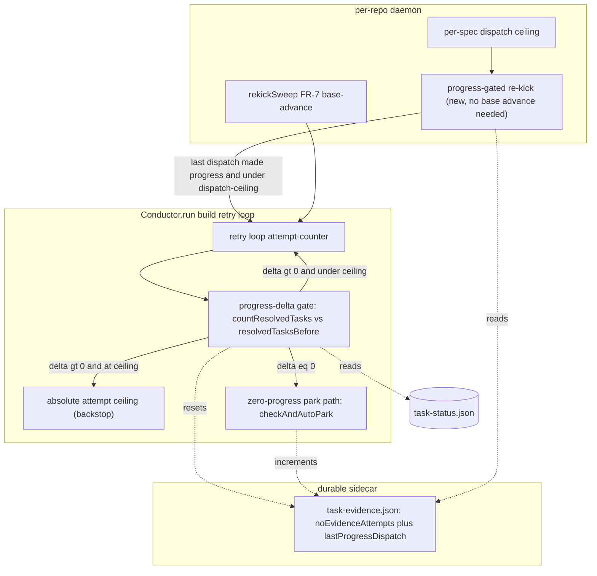

# Architecture: Progress-aware build halt (#280)

**Track:** technical · **Tier:** M · **Approach:** C (hybrid — progress-delta primary, ceiling backstop, progress-gated cross-dispatch re-kick)

## Context

The daemon builds a merged spec by dispatching the `build` step inside a retry loop
(`Conductor.run`). Today the loop is bounded purely by a fixed attempt budget
(`stepMaxRetries = resolved.max_retries`). A multi-batch M/L-tier plan that resolves a few tasks
per attempt exhausts the budget and the step fails, which in daemon mode HALTs or auto-parks — even
though tasks are actively being resolved and nothing is wedged. Across dispatches, a
progressing-but-parked build is only re-kicked by `rekickSweep` on a genuine origin/main advance,
so on a quiet main it parks indefinitely.

This change makes **forward-progress delta** the primary continue/halt signal, retaining an
absolute ceiling as a safety backstop, and adds a **progress-gated cross-dispatch re-kick**.

## Components (C4 — Component level)

## Key decisions

- **Progress-delta is primary, ceiling is a backstop.** The loop continues while a completion-gate
  miss coincides with a positive resolved-task delta; the absolute ceiling only stops pathological
  slow-drip (e.g. one task per dispatch forever). Zero net progress routes straight to the existing
  park path (`checkAndAutoPark`) — no behavior change for genuine wedges.
- **Reuse, don't rebuild, the progress primitive.** `countResolvedTasks` / `resolvedTasksBefore`
  (conductor.ts) and the durable `taskEvidence.noEvidenceAttempts` counter already exist and are the
  ground truth; this change gates the loop/park on them rather than adding a parallel counter. The
  sibling #347 `build-progress-watcher` reads the same `task-status.json` primitive (`countFromParsed`)
  but is observability-only — no shared mutable state, so the two are independent.
- **Cross-dispatch re-kick is progress-gated and bounded.** A build whose most recent dispatch
  resolved >=1 task becomes re-kick-eligible without a base advance, bounded by a per-spec dispatch
  ceiling so a stuck-but-drip build cannot re-kick forever. This is additive to `rekickSweep`
  (base-advance path), not a replacement.
- **Config-driven, safe defaults.** New knobs (absolute attempt ceiling, per-spec dispatch ceiling,
  enable flag) are validated positive integers with conservative defaults; disabling reverts to the
  current fixed-budget behavior.

## Non-goals

- No change to the seed-time empty/missing-plan verdict (parks immediately, unchanged).
- No change to `rekickSweep`'s base-advance semantics.
- No new events/rendering (that is the #347 sibling's surface).
