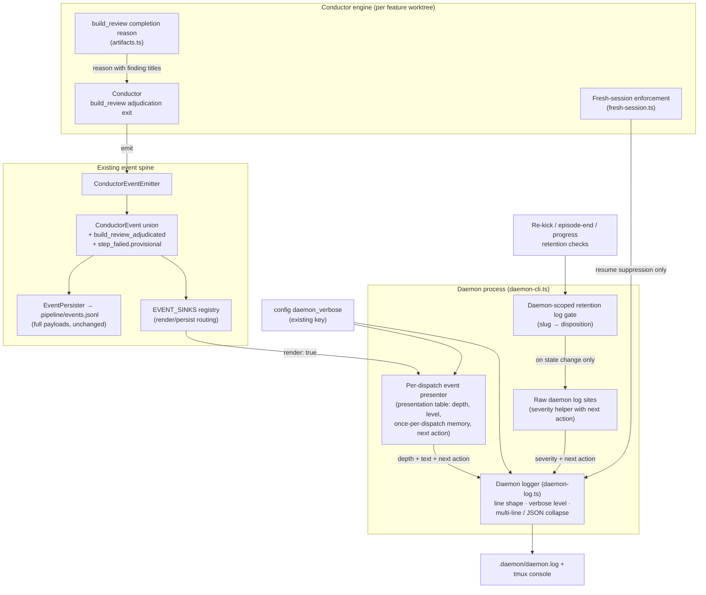

# Components: Daemon log presentation (#2867, covers #2367)

**Last updated:** 2026-10-09
**Scope:** How a daemon occurrence becomes a `.daemon/daemon.log` line after this change: the event spine stays the source, a per-dispatch presenter decides depth, level and next action, and the daemon logger enforces one line shape and the verbose level.

## Diagram

## Legend

- **Event spine** boxes already exist; this change adds one union member (`build_review_adjudicated`) and one optional `step_failed` field (`provisional`). Nothing new is persisted outside `.pipeline/events.jsonl`.
- **Per-dispatch event presenter** replaces direct calls to `renderDaemonEvent` for a feature dispatch. It owns a closed table over rendered event types giving each a fixed depth and level (`default`, `once-per-dispatch`, `verbose`), the memory for once-per-dispatch suppression, and the required next action for warning and halt severity.
- **Daemon-scoped retention log gate** lives for one daemon process and is shared by the three halt-retention checks, so a retained feature is logged when its disposition first appears or changes.
- **Daemon logger** is the single place that composes the line body after the `[daemon][«tag»]` prefix: depth 0 text at column 0, depth 1 after `· `, depth 2 after `·   `, forwarded subprocess lines after `│ ` (verbose only). It collapses multi-line and JSON payloads to one line at default verbosity.
- `daemon_verbose` is the existing boolean config key; `true` restores suppressed lines.

## Change Log

| Date | Change | Reason |
|------|--------|--------|
| 2026-10-09 | Initial generation | Daemon log readability (#2867, #2367) |
