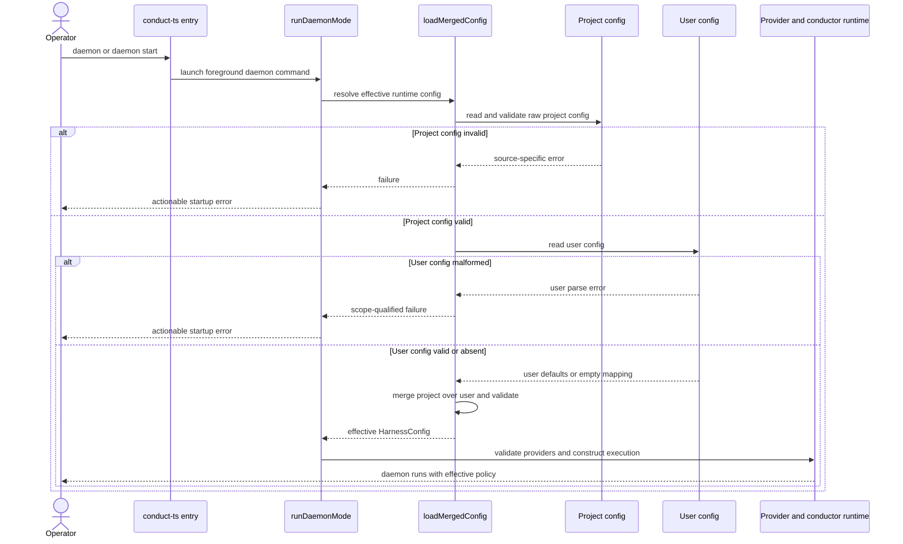

# Sequence: Daemon merged configuration (#967)

**Last updated:** 2026-07-26
**Scope:** Effective user-under-project configuration resolution at daemon runtime startup.

## Diagram

## Legend

- Both supervised and bare launches converge on the foreground daemon command and `runDaemonMode`.
- Project configuration is validated before merging, then overrides matching user values.
- The effective config is resolved once and threaded through existing runtime consumers.
- Machine identity and project-owned full-suite evidence retain their dedicated source boundaries and are outside this sequence.

## Change Log

| Date | Change | Reason |
|---|---|---|
| 2026-07-26 | Added daemon effective-config startup sequence. | Document issue #967's bounded composition-root correction. |
