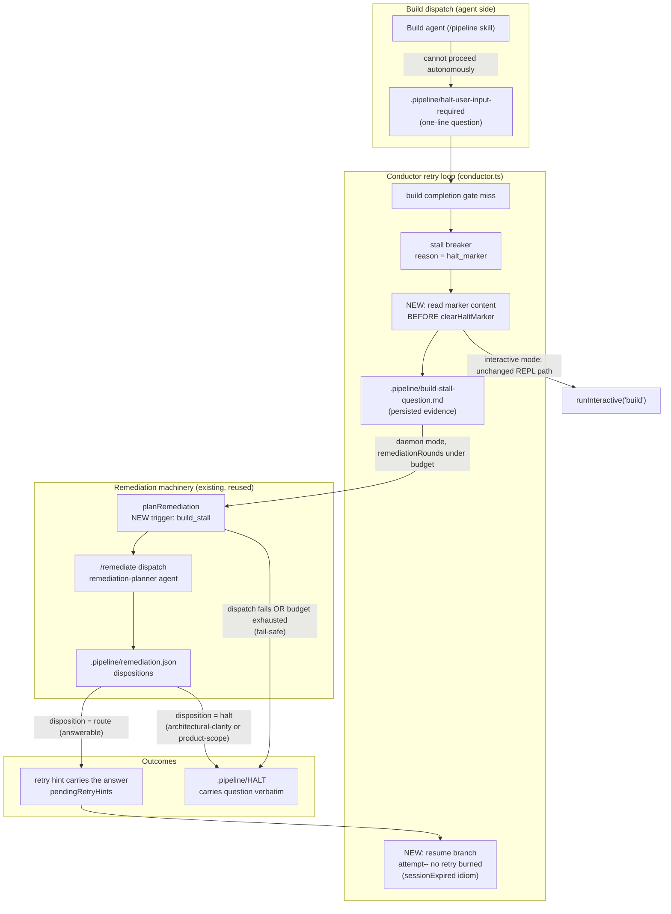

# Components: Daemon Stall Remediation (halt-user-input-required → /remediate)

**Last updated:** 2026-07-10
**Scope:** How a `halt_marker` build stall in daemon mode is routed through the existing
`/remediate` machinery before it may become a feature HALT (#459). Interactive mode is
unchanged (REPL handoff). The implicit `no_task_progress` stall is out of scope (#280).

## Diagram

## Legend

- **NEW** nodes are the additions of #459; everything under *Remediation machinery* exists
  today and is reused unchanged except for the new `build_stall` trigger.
- `remediationRounds` / `MAX_KICKBACKS_PER_GATE` is the shared bound — stall remediations
  consume the same budget as prd_audit/finish/as-built remediations.
- Fail-safe invariant: any path that ends in `.pipeline/HALT` must carry the agent's
  question verbatim as the first line — never the generic "retries exhausted" string.

## Change Log

| Date | Change | Reason |
|------|--------|--------|
| 2026-07-10 | Initial generation | DECIDE for #459 (engineer spec) |
