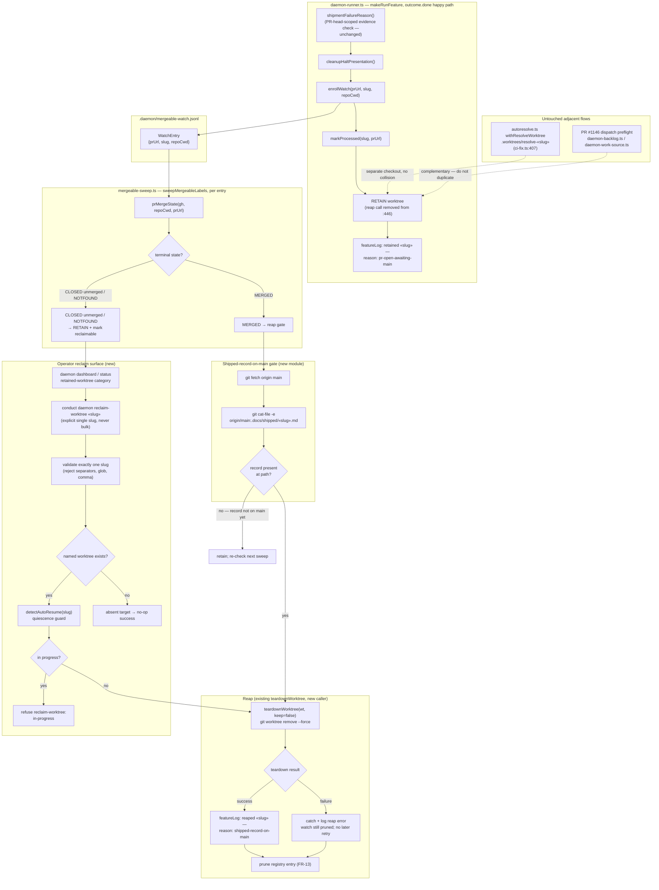

# Components: Deferred Feature-Worktree Reap (#1091)

**Last updated:** 2026-07-29
**Scope:** Moving the feature-worktree reap off the daemon-runner ship path and onto the mergeable
sweep, gated on `.docs/shipped/«slug».md` being present **at path** on `origin/main`; plus
retain/reap logging and the operator reclaim path for closed-unmerged worktrees.

## Diagram

## Legend

- **RETAIN** — the feature worktree and its `.pipeline/` state (task-status plus the evidence
  sidecar, and the artifacts #1118 refuses to reconstruct: `HALT`, `HALT.class`, `QUARANTINE`,
  `DONE`, `finish-choice`, `version-approval`, `conduct-state.json`, `gates/*.json`,
  `protected-artifact-seal.json`, `events.jsonl`) survive past PR-open.
- **Reap gate** — file-presence at path on `origin/main`, never ancestry. Squash-merge rewrites
  history, so `git merge-base --is-ancestor «branch» origin/main` is false for merged work
  (verified 2026-07-29 against squash-merged PR #1138; this is the #1114 trap). `mergedAt` is a
  GitHub assertion about PR state, not about the content of the tree the daemon builds from, so it
  is not the gate either.
- **CLOSED unmerged is separated from MERGED.** Today `mergeable-sweep.ts` prunes both identically
  (FR-13). Under this design only MERGED enters the reap gate; CLOSED-unmerged and NOTFOUND retain
  the worktree and become operator-reclaimable, because a rejected PR is exactly the case where the
  evidence is still needed.
- **MERGED watches are terminal once the record is present.** Successful teardown logs `reaped`;
  teardown rejection is caught and logged, but either outcome prunes the watch, so a failed reap is
  not retried by a later sweep. A missing record still retains the watch for the next pass.
- **Reclaim is explicitly single-slug and quiescence-gated.** Per this repo's Daemon Operations
  Safety rule 1, no globbed or computed delete set: the command validates one slug, no-ops when that
  named worktree is absent, and calls `detectAutoResume` before teardown. A resumable/in-progress
  target is refused; an inactive target's path is printed before removal.
- `.worktrees/resolve-«slug»` remediation checkouts are cut from the branch tip into their own
  directory, so a retained feature worktree does not collide with CI-fix **on disk**.
- **Known accepted regression (descoped to #1150).** `isEligibleForResolve`
  (`autoresolve.ts:216-226`, Gate 6) refuses rebase-resolution for any slug whose `.worktrees/«slug»`
  exists — rule 3 of APPROVED `adr-2026-07-04-resolution-worktree-lifecycle`. Retention makes that
  gate fire on every open PR, so automatic rebase-resolution stops until #1150 repairs the guard.
  `ci-fix.ts` has no such gate and is unaffected. Operator-accepted at DECIDE, 2026-07-29.

## Change Log

| Date | Change | Reason |
|------|--------|--------|
| 2026-07-29 | Added reclaim validation/quiescence guard and terminal reap-error disposition | Batch 2 as-built update |
| 2026-07-29 | Initial generation | DECIDE for #1091 |
