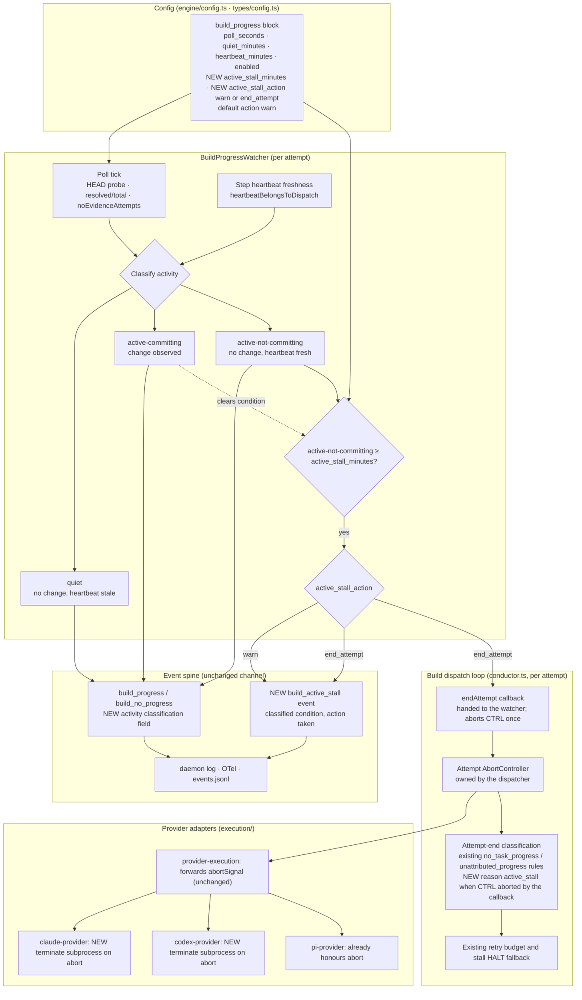

# Components: active-but-not-committing build attempts are classified and optionally ended

**Last updated:** 2026-10-02
**Scope:** The per-attempt build-progress watcher, the build dispatch loop that owns the attempt,
and the provider adapters that must honour cancellation. It covers how one build attempt whose
provider stays active without advancing HEAD or the task count is classified on the existing
event spine and, when a project opts in, ended. Every other step, the quiet warning's
existing display fields, and the attempt-end stall breaker's rules are unchanged.

## Diagram

## Legend

- **NEW** marks additions; everything else exists today.
- The watcher never ends a process itself. It calls the dispatcher's `endAttempt` callback, and
  the dispatcher remains the only authority over its attempt's cancellation.
- "Heartbeat fresh" means the step heartbeat belongs to this dispatch and is newer than the
  quiet threshold. It is the same check the quiet warning already uses for `lastActivityAt`.
- An observed HEAD or task change returns the attempt to active-committing and clears an armed
  condition, so a step that resumes committing is never ended.

## Change Log

| Date | Change | Reason |
|------|--------|--------|
| 2026-10-02 | Initial generation | #2102: act on builds that are active but not advancing HEAD |
