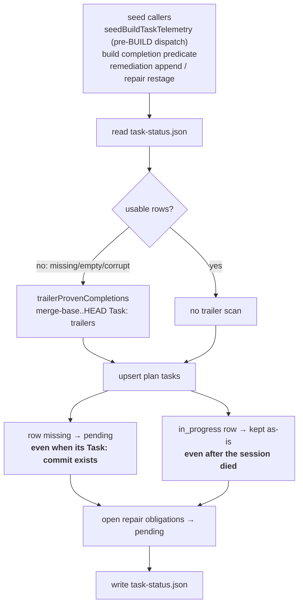
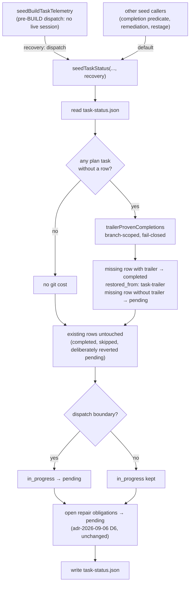

# Architecture: Task-status recovery after abrupt daemon death

**Last updated:** 2026-10-03
**Scope:** `seedTaskStatus` (`src/conductor/src/engine/task-seed.ts`) and its pre-BUILD dispatch
caller `seedBuildTaskTelemetry` (`src/conductor/src/engine/conductor.ts`). Covers how a
`.pipeline/task-status.json` that survived an abrupt daemon death is reconciled with committed
`Task:` trailers and stale `in_progress` rows. Intake: jstoup111/ai-conductor#2673.

## Current state (the defect)

## Planned state

## Legend

- **Bold** labels in the current state mark the two #2673 defects.
- The trailer scan stays branch-scoped (`merge-base(origin, HEAD)..HEAD`) and fails closed: no
  provable range means no restored completions.
- Restore is additive: only a plan task with **no** row can gain a `completed` row. An existing
  `pending` row is never upgraded, so deliberately reopened or restaged rows stay pending.
- The open-repair override runs last, so an open repair obligation is never restored as
  completed from an old trailer.

## Change Log

| Date | Change | Reason |
|------|--------|--------|
| 2026-10-03 | Initial generation | DECIDE for #2673 (abrupt-death task-status recovery) |
