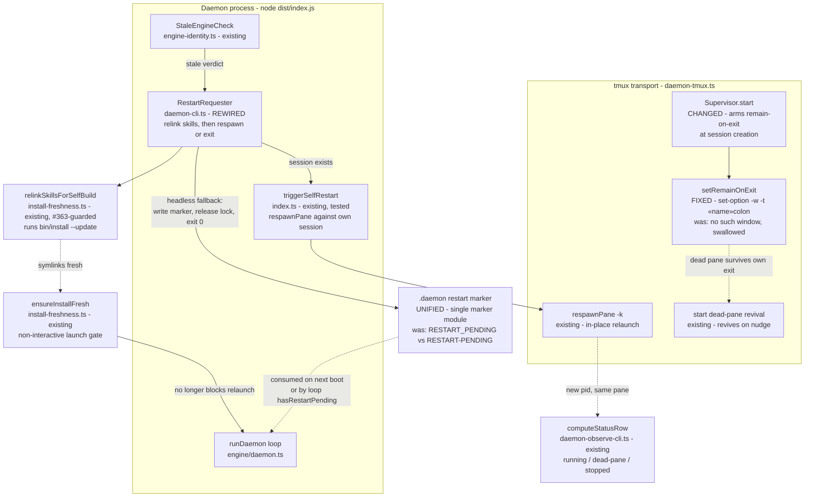

# Components: Stale-engine restart respawn wiring (#353)

**Last updated:** 2026-07-06
**Scope:** Closes the respawn gap in the stale-engine auto-restart (issue jstoup111/ai-conductor#353): the stale-engine restart now rides the #215 respawn-in-place transport instead of a bare exit, `remain-on-exit` is actually armed (the tmux invocation was silently broken), and the skill relink runs on the restart handoff so `ensureInstallFresh` cannot block the relaunch after an origin advance.

## Diagram

## Legend

- **FIXED / CHANGED / REWIRED / UNIFIED** mark the four deltas of this feature; every other node exists today and is untouched.
- `«name»colon` denotes the corrected tmux target form `=«session-name»:` with the `-w` window flag — the prior form (`-t =«session-name»`, no `-w`) failed `no such window` on tmux 3.2a and the non-zero exit was swallowed as best-effort, so `remain-on-exit` was never in effect anywhere.
- **Marker unification:** `restart-intent.ts` (`RESTART_PENDING`, underscore — stale-engine handshake) and `restart-marker.ts` (`RESTART-PENDING`, hyphen — busy-queue respawn) converge so a stale-engine restart is visible to the existing `hasRestartPending → triggerSelfRestart` path. The startup handshake (loop-guard, consume-once, non-convergence suppression) is preserved.
- **Order matters in RestartRequester:** relink skills → then respawn (or exit). The respawned process re-runs `ensureInstallFresh` non-interactively; relinking first is what keeps the relaunch from throwing `InstallStaleError` after an origin advance introduced new skills.
- Headless fallback (no tmux session, e.g. bare `daemon --continuous` in a terminal): behavior unchanged from the approved ADR — write marker, release pidfile, exit 0; the dead-pane/`ensureRunning` revival or the operator brings it back.
- **Queued (busy) restarts relink at fire time too:** when the human-queued `RESTART-PENDING` marker fires `triggerSelfRestart` at the idle boundary, the same injectable relink runs first; on relink failure the fire is skipped (logged, marker retained for retry). Both restart entry points therefore hand off with fresh skills.

## Failure semantics

- `setRemainOnExit` failure is now **loud** (logged with the tmux stderr) — still non-fatal, but never silent; the smoke test asserts the option is actually set (`show-options`) rather than only asserting respawn-while-alive works.
- `respawnPane` failure in the stale path degrades to the headless fallback (marker + exit) — never a torn-down session with no marker.
- Relink failure (e.g. #363 guard refuses a worktree-rooted install) is logged loudly and **aborts the restart attempt** — the daemon keeps running the old engine and retries at a later boundary. Never respawn into a known-blocked freshness gate: stale-but-alive beats down-and-blocked.
- All existing gates on the stale verdict (self-host, config flag, determinate identity, loop-guard) are unchanged.

## Change Log

| Date | Change | Reason |
|------|--------|--------|
| 2026-07-06 | Initial generation | DECIDE phase for issue jstoup111/ai-conductor#353 |
| 2026-07-06 | Relink-failure = abort-attempt; queued-fire relink note | Plan update (ADR approval + Task 13) |
