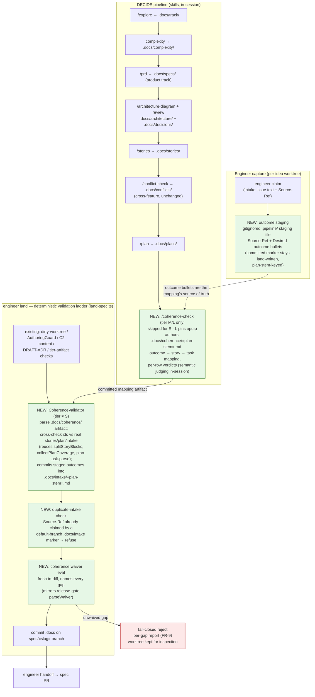

# Components: DECIDE Artifact Coherence Check

**Last updated:** 2026-07-22
**Scope:** Where the coherence check sits in the DECIDE pipeline and the `engineer land`
validation ladder. Feature: intake jstoup111/ai-conductor#539, tier M, product track.
PRD: `.docs/specs/2026-07-22-decide-artifact-coherence-check.md`.

## Diagram

## Legend

- **Green nodes** — new components introduced by this feature.
- **Red node** — fail-closed rejection path.
- **Dashed edge** — data dependency (not control flow).
- `«…»` — variable placeholder (slug, plan stem).
- The LLM contributes only inside `/coherence-check` (semantic outcome↔story judging,
  in-session). Everything at the land boundary is deterministic code — per the harness
  "deterministic where possible" principle, an authoring-session self-report can never
  pass the gate (PRD FR-14, NFR).
- Negative paths (PRD FR-10..12): technical track → mapping omits the FR layer; no-intake
  idea → mapping omits the outcome layer; S-tier spec → step skipped and validator does
  not engage; fully-coherent M/L chain → validator passes silently, no operator
  interaction.

## Change Log

| Date | Change | Reason |
|------|--------|--------|
| 2026-07-22 | Initial generation | DECIDE-phase design for intake #539 |
| 2026-07-22 | Outcome persistence → .pipeline staging; dup scan → intake markers only; S-tier exemption; L-tier opus step-up | Conflict-check resolutions + operator ruling |
