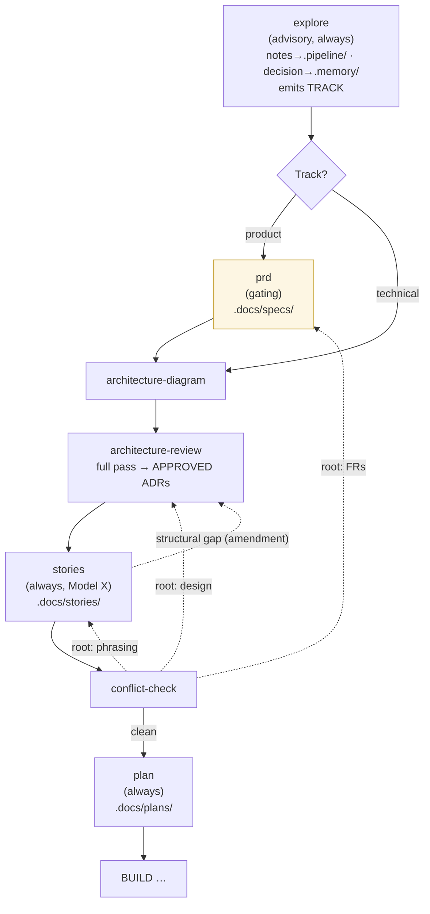
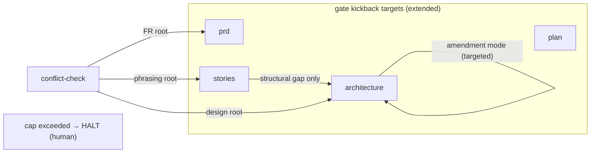

# Architecture: DECIDE pipeline restructure

**Date:** 2026-06-29
**Spec:** .docs/specs/2026-06-29-decide-pipeline-restructure.md

## DECIDE flow (target state)

Tier note: `architecture-diagram`, `architecture-review`, `conflict-check` are skipped for Small;
`explore`, `stories`, `plan` always run.

## Kickback edges (convergence)

## Component / artifact map

| Concern | Component | Change |
|---|---|---|
| Step identity | `types/steps.ts` `StepName`, engineer `DecideStep` | remove `brainstorm`; add `explore`, `prd` |
| Ordering | `engine/steps.ts` `ALL_STEPS`; engineer `runAuthoring` order | reorder: explore→[prd]→arch→stories→conflict→plan |
| Track marker | `.docs/track/<slug>.md`; `artifacts.ts` `parseTrack()` | new (mirrors `parseComplexityTier`/`parseIntakeSourceRef`) |
| Conditional PRD | conduct skip logic; `land-spec` required-artifacts; `prd-audit` gate | track-aware (skip when technical) |
| Gate machinery | `gate-verdicts.ts`, `selector.ts` | kickback targets → `{prd, architecture, stories, plan}` |
| Arch convergence | `architecture-review` skill | full vs amendment mode; structural-gap bar; cap→HALT |
| Daemon | `daemon-cli.ts` `PRESEEDED_DONE`; `daemon-backlog.ts` `discoverBacklog` | swap brainstorm→explore+prd; read track; default product |
| Skills | `skills/` | new `explore`, `prd`; retire `brainstorm`; update `stories`/`conflict-check`/`architecture-review` |
| HARNESS | `HARNESS.md` | model table rows for explore/prd; product-only convention (from #142) |
| Migration | state load | `brainstorm:done` ⇒ `explore:done` + `prd:done|skipped` |
