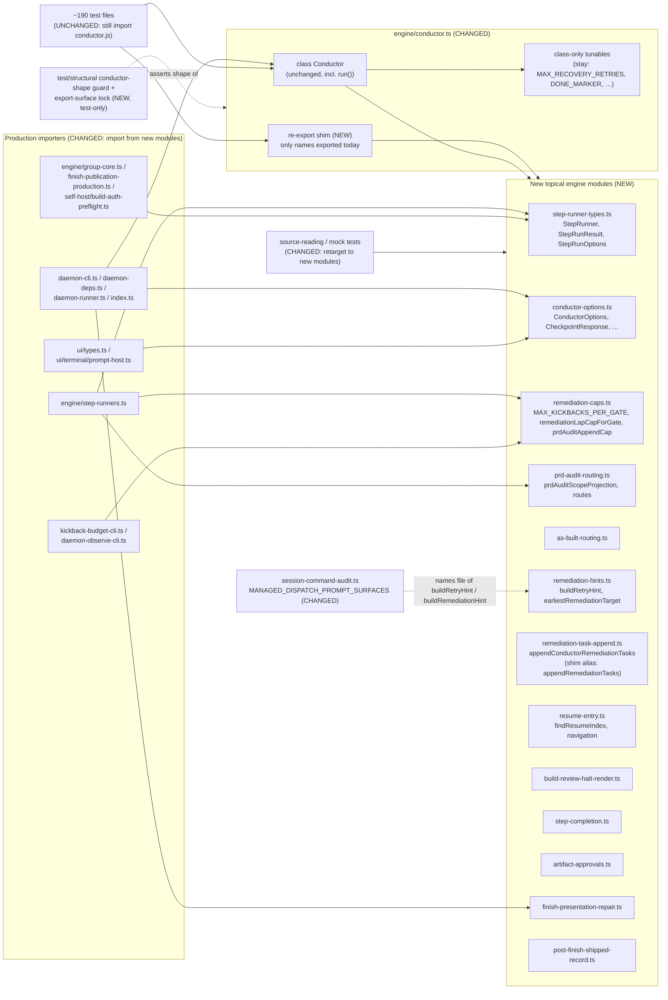
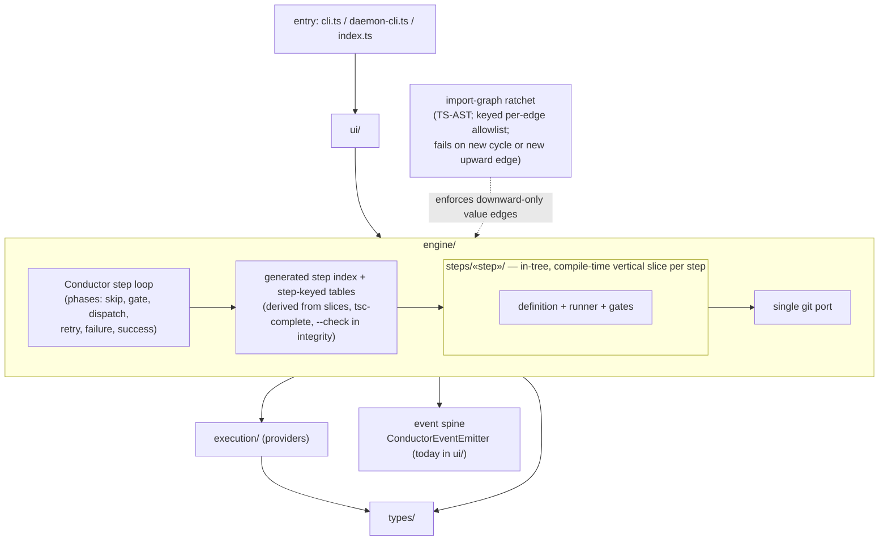

# Components: conductor.ts decomposition — module-level evacuation and target shape (#1481)

**Last updated:** 2026-10-07
**Scope:** Two views. **(1) Feature 1 (built by this spec):** the module-level declarations of
`src/conductor/src/engine/conductor.ts` — everything outside `class Conductor` (lines 513–2253,
16437–17209, and `writeBuildOutcomeBestEffort` at 377 among the imports; ~2,950 lines) — move into topical engine modules, with `conductor.ts` re-exporting the
moved names as a transitional shim. **(2) Target architecture (direction only, delivered by later
roadmap slices):** enforced layering and vertical per-step slices with no hand-edited central
registries. `class Conductor` itself, including `run()`, is unchanged by feature 1.

## Diagram 1 — Feature 1: module-level evacuation

## Diagram 2 — Target architecture (roadmap direction)

## Legend

- **NEW** / **CHANGED** / **UNCHANGED** mark feature-1 impact. Diagram 2 is direction, not the
  feature-1 deliverable. Each element arrives through its own roadmap slice, recorded in the ADR.
- **Re-export shim:** `conductor.ts` keeps `export { … } from` / `export type { … } from` for every
  moved name, so the ~197 test files and the two whole-module `vi.mock('…/conductor.js')` tests
  keep resolving. A later roadmap slice migrates the tests and deletes the shim.
- **Shim scope:** the shim re-exports only names `conductor.ts` exports today (types via
  `export type`, required by `isolatedModules`). Class-only private helpers that move become exports
  of their new module only. They are not added to the `conductor.js` surface.
- **Tests that do change:** tests that read `conductor.ts` source text for moved code (for example
  `finish-publication-production-wiring.test.ts:148` and `task-seed.test.ts:425-437`), and the
  `vi.mock` of `createProvenanceGuardedFinishPresentationRepair` in
  `daemon-state-refusal-event.test.ts:43-58`, move to the new module paths.
- **Production gate re-pointed:** `MANAGED_DISPATCH_PROMPT_SURFACES`
  (`session-command-audit.ts:36`) identifies `buildRetryHint` and `buildRemediationHint` by the
  file name `conductor.ts`. The entry moves with them to `remediation-hints.ts`. Otherwise the
  operator-only-instruction gate stops checking those prompts without any error.
- **Containment checks extended:** `test/engine/engineer/non-autonomy.test.ts` forbids the engineer
  from reaching `conductor.ts`. Its target list gains the new push-capable modules
  (`post-finish-shipped-record.ts`, `finish-presentation-repair.ts`).
- **Conductor-shape guard (NEW test):** an AST test asserts that `conductor.ts` contains only
  imports, the re-export shim, the allowed class-only tunables, and `class Conductor`. A rebased
  in-flight branch therefore cannot re-add module-level code next to the shim.
- **`MAX_KICKBACKS_PER_GATE`** moves to `remediation-caps.ts`, and the class imports it. It is
  shared by the cap functions, so leaving it in `conductor.ts` would force a cycle.
- Module names in Diagram 1 come from the planning inventory; `/plan` confirms the final names.
  `remediation-task-append.ts` is new because `remediation-append.ts` already exports a different
  `appendRemediationTasks`.
- No new module imports `conductor.ts`. No module-level item references `Conductor`, so the move
  adds no value import cycle. It removes the existing `step-runners.ts → conductor.ts` value
  back-edge.
- Diagram 2 layering is `types ← execution ← engine ← ui ← entry`, as stated in
  `docs/contributing/code-organization.md`. Arrows mean "imports".
- Diagram 2 constraints, recorded in the ADR:
  - **Steps are not plugins.** Step slices are in-tree and compile-time discovered. They do not
    revive the `step` plugin kind retired by ADR 002's amendment.
  - **Step-keyed tables stay single-source and tsc-complete.** They become *generated from* the
    slices, which amends adr-2026-07-03-generated-model-table-single-source rather than
    contradicting it.
  - **Existing violations are baseline, not fixed by fiat.** Engine value-imports the event spine
    from `ui/events.ts`, and there are 13 `execution → engine` value edges, so
    `code-organization.md:176` is stale. The ratchet allowlists today's edges and only forbids new
    ones; relocating the emitter is its own slice.

## Change Log

| Date | Change | Reason |
|------|--------|--------|
| 2026-10-07 | Initial generation | #1481 decomposition roadmap; feature 1 = module-level evacuation |
| 2026-10-07 | Adversarial revision: audit-registry re-point, source-reading tests, shim scope, shape guard, `MAX_KICKBACKS_PER_GATE`, Diagram 2 constraints | Adversarial diagram review |
| 2026-10-07 | Plan update: final module names confirmed; `appendConductorRemediationTasks` rename with shim alias; guards are test-side (`test/structural/`) | `/plan` for #1481 feature 1 |
