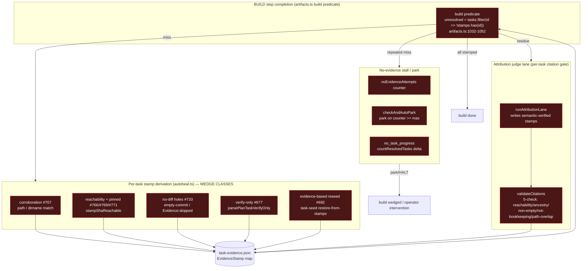
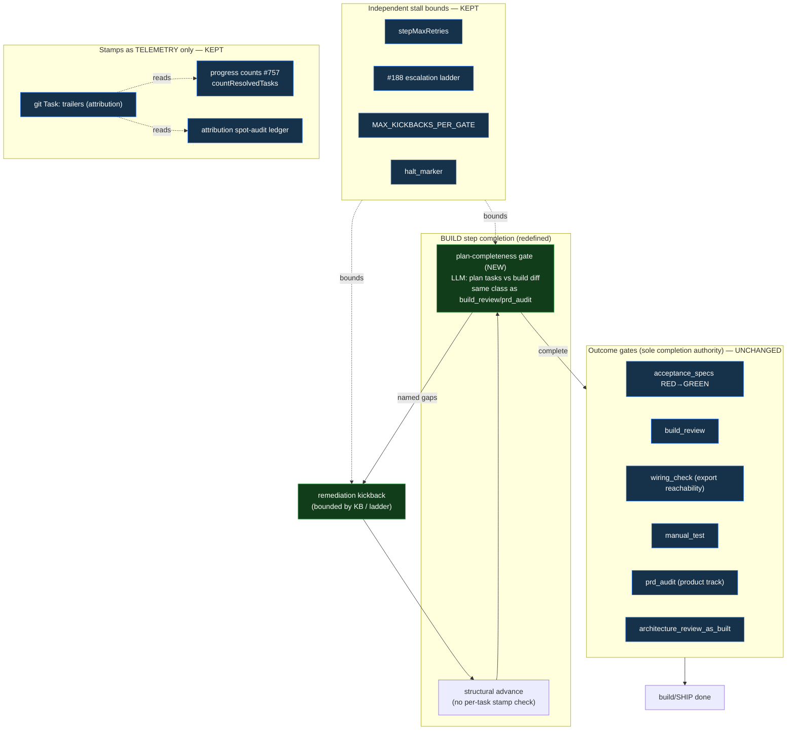
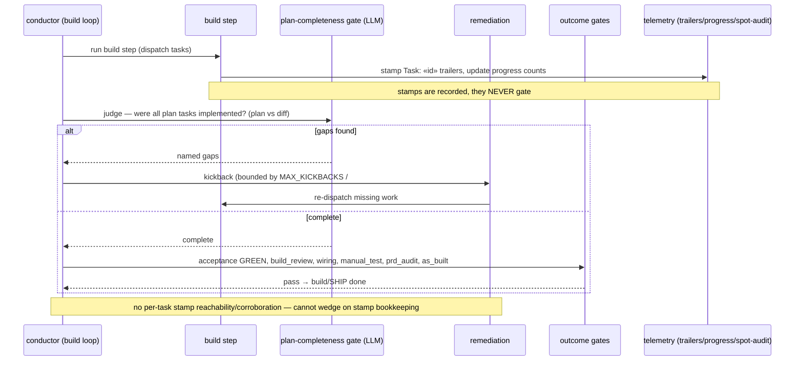

# Components & Flow: BUILD-phase Completion Authority (#773)

**Last updated:** 2026-07-21
**Scope:** The BUILD-phase completion authority in the conductor engine — how the build step
decides "done" — BEFORE and AFTER demoting per-task stamping from a gate to telemetry. Focused
component + sequence view (this change modifies a state machine, not the L1/L2 topology).

## Diagram 1 — BEFORE: per-task evidence-ledger gate (the wedge surface)

## Diagram 2 — AFTER: build-end judgement gate + telemetry-only stamps

## Diagram 3 — AFTER: build-completion sequence

## Legend

- **Red nodes (Diagram 1):** code paths DELETED by #773 — the per-task mechanical stamp gating
  and its wedge classes (#692/#677/#707/#733/#766/#769/#771).
- **Green nodes (Diagram 2/3):** NEW — the single build-end LLM plan-completeness judgement gate
  and its bounded remediation kickback.
- **Blue nodes:** KEPT unchanged — the outcome gates that become the sole completion authority,
  the independent stall bounds, and the stamps surviving as pure telemetry.
- **Separate same-named gates that stay untouched** (not shown as changed): `wiring_check` export
  reachability, acceptance-specs RED-evidence, shipped-record dedup ledger, owner-gate provenance,
  push-evidence finish false-ship guard. They share vocabulary ("reachability"/"evidence"/"ledger")
  with the demoted gate but are distinct systems.

## Change Log

| Date | Change | Reason |
|------|--------|--------|
| 2026-07-21 | Initial generation | Created during DECIDE for #773 (demote task-stamping to telemetry) |
