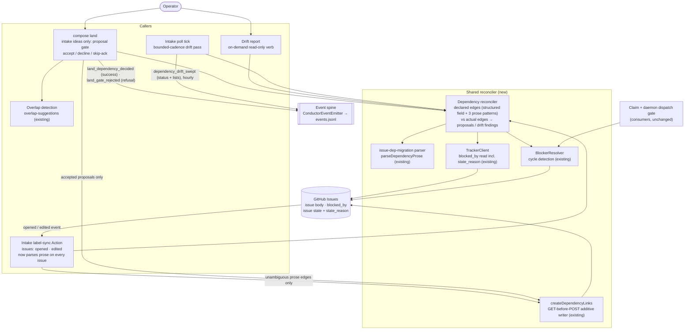

# Components: Dependency Edge Reconciler (#536)

**Last updated:** 2026-10-09
**Scope:** The three callers that author and verify GitHub issue `blocked_by` edges, and the
shared reconciler they depend on. The consumer side (claim-time blocker filtering and the daemon's
waiting channel via `BlockerResolver`) is unchanged and is shown for context only. Structured
`--depends-on` linking at filing time has already shipped and is shown for context.

## Diagram

## Legend

- **Shared reconciler (new):** the one module that computes declared-vs-actual edges. Every caller
  goes through it, so the grammar and comparison rules cannot drift between paths.
- **Writes** reach GitHub only through the existing additive writer, and only from two paths:
  unambiguous prose edges from the Action, and operator-accepted proposals from land. The drift
  report and the poll pass are read-only.
- **Event spine:** land decisions and drift sweeps are new `ConductorEvent` variants. No sidecar
  report file is written.
- Double-bordered nodes are existing infrastructure; cylinder = external system.

## Change Log

| Date | Change | Reason |
|------|--------|--------|
| 2026-10-09 | Initial generation | DECIDE for #536 (dependency-edges-are-hand-maintained-intake-and-de) |
