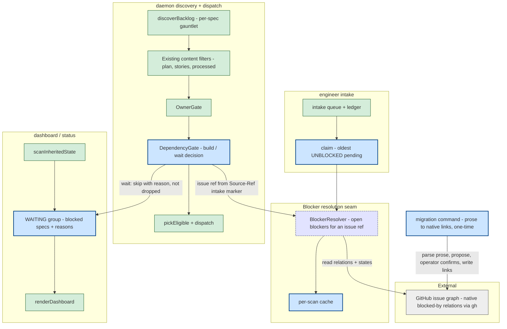
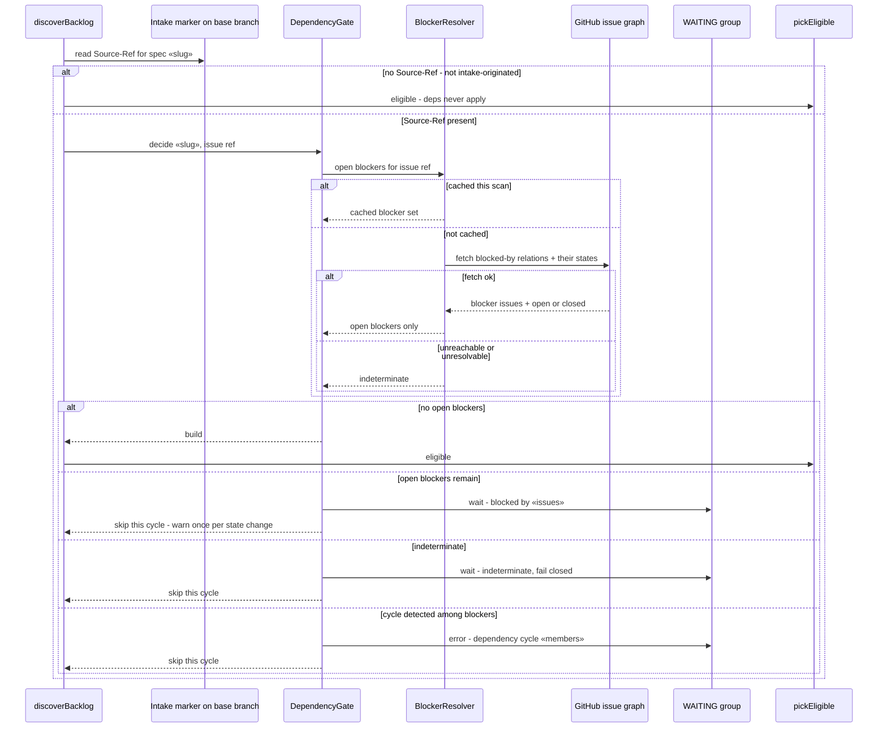
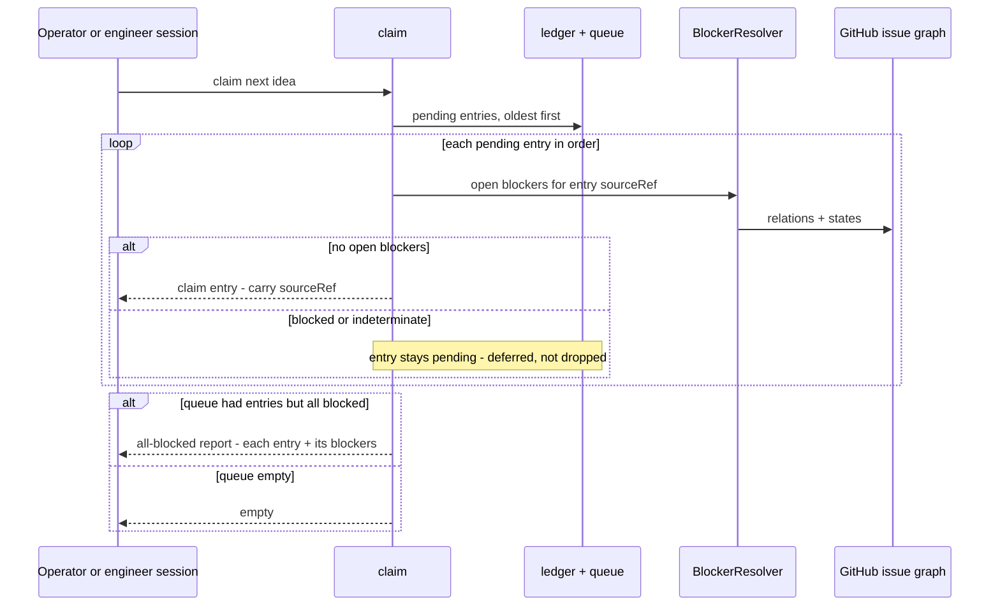

# Components + Sequences: Dependency-Ordered Intake and Dispatch

**Last updated:** 2026-07-03
**Scope:** Where dependency gating sits in the daemon's discovery path (`discoverBacklog`) and
the engineer intake claim path, the shared blocker-resolution seam over the GitHub issue graph,
the new WAITING dashboard group, and the one-time prose→link migration. PRD:
`.docs/specs/2026-07-03-dependency-ordered-intake-and-dispatch.md` (issue #229).

## Component View (the shared seam)

## Sequence: gating one content-and-owner-eligible spec (per scan cycle)

## Sequence: intake claim deferral

## Legend

- **DependencyGate** — new decision unit in the `discoverBacklog` gauntlet, running **after**
  the owner gate (cheapest-first: content filters, then ownership, then a network-touching
  dependency check on the survivors). Skip is per-cycle, never a drop.
- **BlockerResolver** — the single seam both the daemon gate and intake claim use to answer
  "which open issues block this issue ref?" over GitHub's native blocked-by relations. One
  implementation, one cache policy, one indeterminate semantics; architecture-review ratifies
  its API surface (GraphQL vs REST) and cache scope.
- **WAITING group** — new dashboard/status bucket alongside HALTED / IN-PROGRESS / ELIGIBLE /
  PROCESSED (closes the #208 invisibility class for this gate). Requires `discoverBacklog` to
  emit skipped-with-reason items rather than only logging them.
- **fail closed** — indeterminate blocker state (GitHub unreachable, ref unresolvable) waits
  visibly instead of building (PRD FR-7); deliberate inversion of the owner-gate's fail-open.
- **migration command** — one-time, operator-confirmed, idempotent/additive prose→link pass
  (PRD FR-10/11); after it runs, native relations are the only recognized declaration form.

## Change Log

| Date | Change | Reason |
|------|--------|--------|
| 2026-07-03 | Initial feature diagram | Created during DECIDE for dependency-ordered intake and dispatch (#229) |
