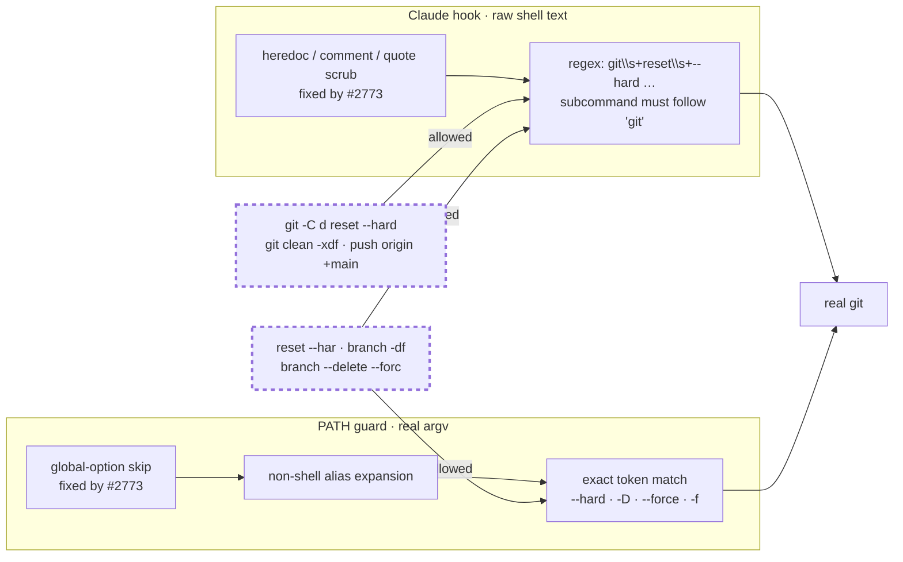
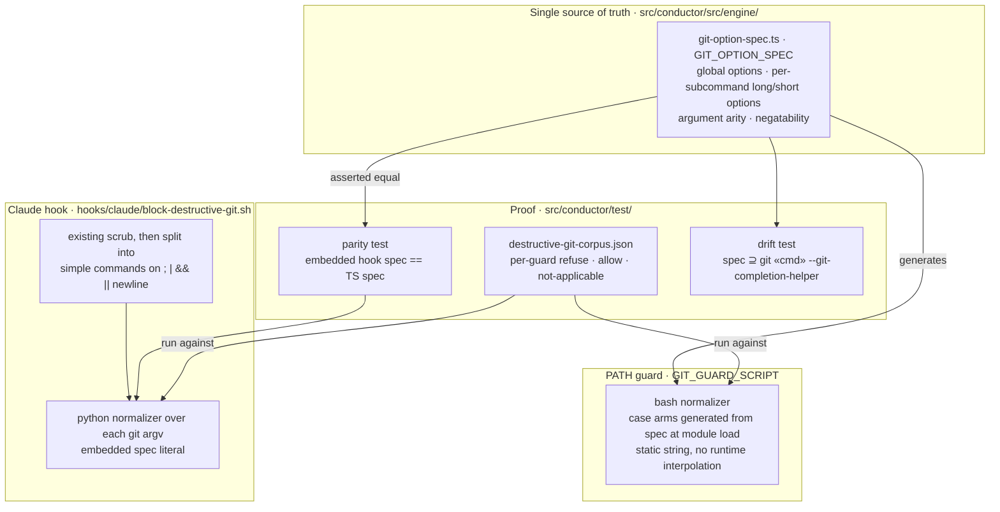
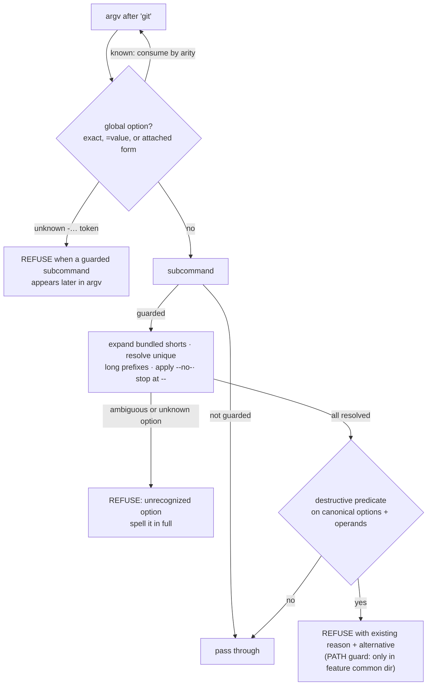

# Architecture: fail-closed git option normalizer for both destructive-git guards (#2904)

**Stem:** `destructive-git-guard-parser-misses-valid-git-and-`
**Tier:** M
**Last updated:** 2026-10-03

## Scope

Both destructive-git guards classify a git invocation only after normalizing its arguments the way
git's parse-options does. For the six guarded subcommands (`reset`, `branch`, `clean`, `push`,
`checkout`, `restore`), an option the guard cannot resolve is refused rather than passed through.

- **PATH guard:** `GIT_GUARD_SCRIPT` in `src/conductor/src/engine/git-hook-assets.ts` sees the real
  argv in every agent provider child.
- **Claude hook:** `hooks/claude/block-destructive-git.sh` is the operator `PreToolUse` hook shipped
  to consumers. It sees raw shell text.

Out of scope:

| Deferred | Where |
|---|---|
| Shell indirection in the Claude hook (`$g reset`, `eval`, `bash -c "…"`) | Accepted gap. The hook header documents it, and the PATH guard covers it in self-host runs. |
| Git alias expansion in the Claude hook | The PATH guard only. The hook stays git-call-free for classification, and existing tests stub `git` to fail if it is called. |
| Git-side `reference-transaction`/`pre-push` veto | #2693 (in flight) |

## Current state: exact-token matching, default allow

Both guards were verified on git 2.53.0 on 2026-10-03.

## Target state: one spec, two normalizers, one corpus

## Normalize-then-classify flow (both guards)

## Legend

- **Dashed nodes** are bypass classes verified against the current guards.
- **Spec** is data: the option names, short letters, and arity for each guarded subcommand, plus the
  global options. No guard hard-codes its own grammar.
- **Parity test:** a static shipped hook cannot import TypeScript, so the hook carries a literal copy
  of the spec. A test fails if the copy differs from the TS spec.
- **Drift test:** fails when git's completion helper lists an option the spec doesn't know. The
  helper omits some options (for example `--force` for `clean` and `branch`), so the check is
  superset-only.

## Change Log

| Date | Change | Reason |
|------|--------|--------|
| 2026-10-03 | Initial generation | #2904 DECIDE: fail-closed normalizer chosen over git delegation and default-allow normalization |
| 2026-10-03 | Named the spec module and corpus fixture; corpus carries per-guard expectations | /plan update after conflict-check resolution |
