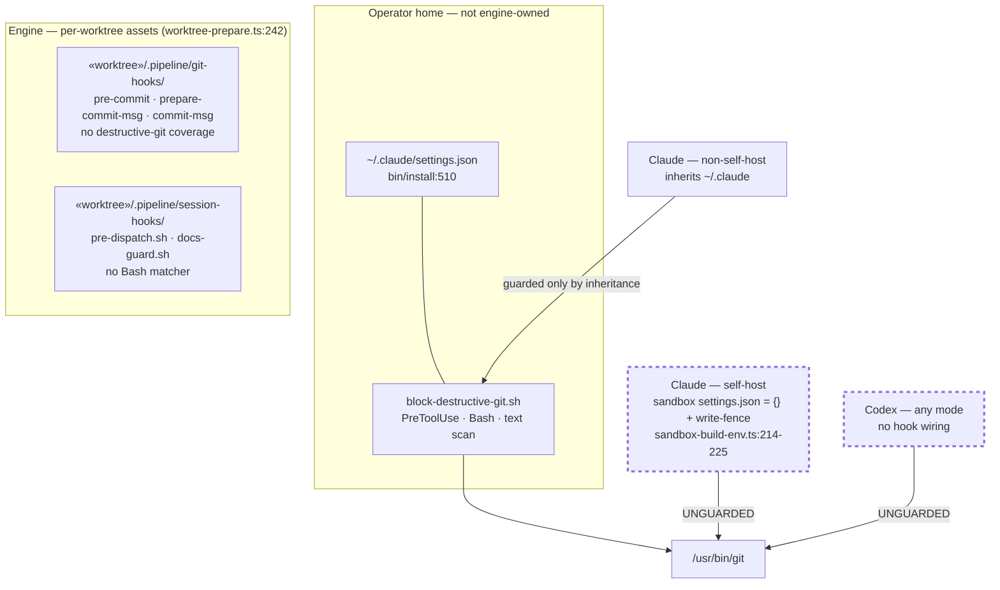
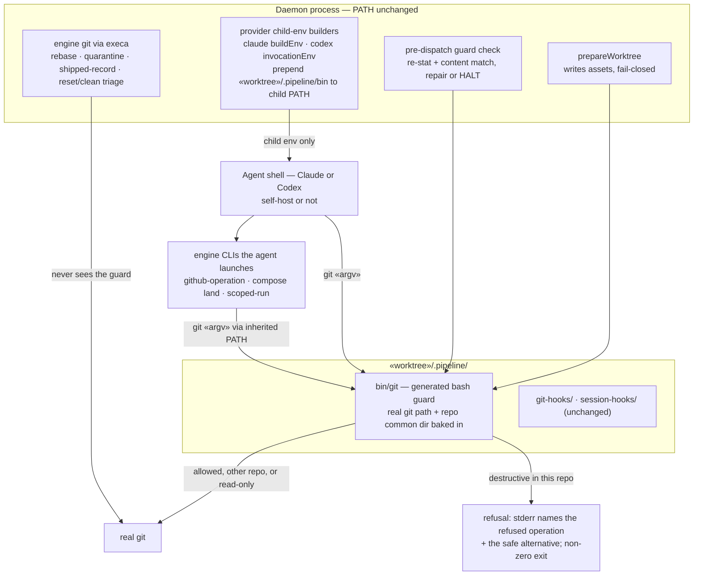
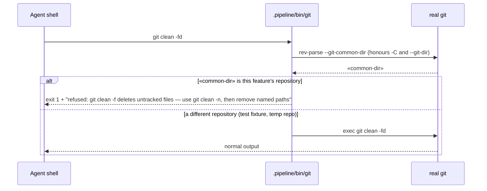

# Architecture: engine-owned destructive-git guard for every provider and run mode (#1354)

**Stem:** `destructive-git-prevention-is-absent-in-self-host`
**Tier:** M
**Last updated:** 2026-09-23

## Scope

Destructive-git prevention moves from the operator-inherited Claude `PreToolUse` hook into an
engine-provisioned `git` argv guard. The engine puts the guard first on `PATH` in every agent
provider child environment, so the same control applies to Claude and Codex, in self-host and
non-self-host daemon runs. The operator hook `hooks/claude/block-destructive-git.sh` stays as early
feedback (adr-2026-08-07-provider-neutral-commit-gate-for-protected-artifacts), and its heredoc
false positive is fixed.

Out of scope:

| Deferred | Where |
|---|---|
| Git-side `reference-transaction`/`pre-push` backstop for ref moves that bypass the guard | #2693 |
| OS-level sealing (the adversarial bypass class) | #1352 |
| Refusal telemetry on the event spine | not filed (operator: out of scope 2026-09-23) |
| Remote protection of `main`/`stable` | already enforced by the GitHub rulesets "disable main" and "protect stable" (`deletion`, `non_fast_forward`; bypass only through a PR) |

## Current state — prevention only through the operator's home

The guard matches command text, so a destructive command quoted in a heredoc body counts as running
it. That false positive was observed while filing #1354.

## Target state — one engine-owned guard on every agent PATH

> **Amended 2026-09-23 by #1354 (plan update):** the guard does not bake values into its source. `SHIM` is the static `GIT_GUARD_SCRIPT` asset (`git-hook-assets.ts`). The real-git path and the repository common dir are data files in `«worktree»/.pipeline/git-guard/`, written by `writeGitGuard` in the new `git-guard.ts`. `VERIFY` is `ensureGitGuardForDispatch`, called from each adapter's `invoke`. `ENV` applies `withGitGuardPath` (`child-environment.ts`) and, for Codex, `shell_environment_policy.set.PATH`. Build-review containment mounts `.pipeline/bin`, `.pipeline/git-guard` and the real git read-only.

## Refusal flow

## Refusal matrix

These apply only when the target repository's common dir equals the feature repository's.

| Class | Refused | Still allowed | Safe alternative in the message |
|---|---|---|---|
| Force push | `push --force`, `-f`, `+«refspec»` | `--force-with-lease`, `--force-if-includes` with lease, plain push | `git push --force-with-lease` |
| Hard reset | `reset --hard` | `reset --keep`, `--soft`, `--mixed` | `git reset --keep «target»` |
| Unmerged branch delete | `branch -D`, `branch --delete --force` on a branch not an ancestor of the default branch | `-d`; `-D` of an ancestor-merged branch | `git branch -d`, or ask the operator |

| Forced clean | `clean -f` and any combination with `-f` or `--force` | `clean -n`/`--dry-run` | `git clean -n`, then remove named paths |
| Path discard | `checkout [«tree-ish»] -- «paths»`, `restore «paths»` that target the working tree | `checkout --ours`/`--theirs`/`--merge -- «paths»`, `restore --staged` only, branch switch without pathspec | commit a WIP first, or run the check in a temporary worktree |

> **Amended 2026-09-23 by #1354:** conflict-check changed the unmerged-branch row. `-D` is refused only when the branch tip is not reachable from any other local branch or remote-tracking ref, and allowed otherwise. See adr-2026-09-23-engine-git-guard-on-agent-path decision 5.

## Known limits (documented, not mechanically closed)

- A `git` invoked by absolute path, or from a process whose `PATH` drops the guard directory,
  bypasses it. Ref-moving cases are covered by #2693, and the rest by #1352.
- Interactive and inline runs never call `prepareWorktree`, so they have no guard. They keep the
  operator hook.
- Custom and third-party providers get no `PATH` prepend.
- build_review dispatches run under a containment profile with read-only source mounts
  (adr-2026-09-10-portable-build-review-policy D5), which is where the protection for those sessions
  comes from.

## Change Log

| Date | Change | Reason |
|------|--------|--------|
| 2026-09-23 | Initial generation | #1354 DECIDE |
| 2026-09-23 | Plan update: guard data files, per-dispatch ensure, containment mounts | /plan step 8b |
