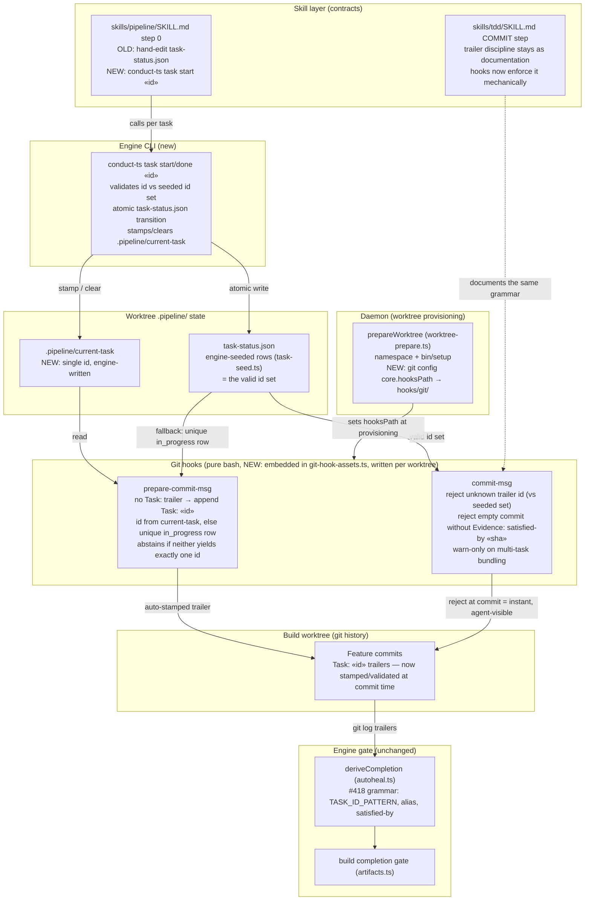
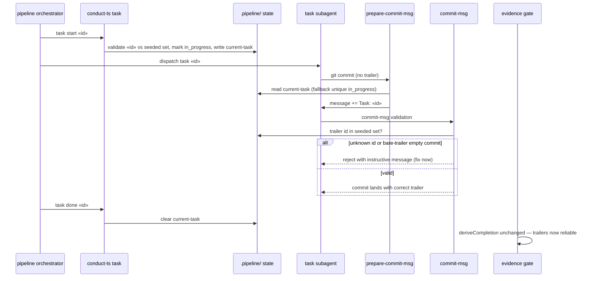

# Component Diagram: Deterministic Build Evidence Attribution (#433)

**Last updated:** 2026-07-09
**Scope:** The attribution path from per-task dispatch to evidence-gate verdict, and where
#433 moves it from prompt discipline to machinery: an engine-owned `conduct-ts task` CLI
that owns `task-status.json` transitions and stamps `.pipeline/current-task`, plus two
pure-bash git hooks (`prepare-commit-msg` auto-stamp, `commit-msg` validation) wired
per-build-worktree via `core.hooksPath` at `prepareWorktree` time. The evidence gate is
unchanged and remains the final arbiter.

## Diagram

## Sequence: one per-task build dispatch under #433

## Legend

- **NEW** markers — surfaces this feature adds or changes; everything in **Engine gate**
  is deliberately untouched (the gate stays the single completion authority, per #302/#418).
- **Pure bash hooks** — read only `.pipeline/` files and git state; no dependency on the
  worktree's built engine `dist`, so they cannot run stale engine code (#403 class).
- **Abstain** — when the stamp source is ambiguous (0 or >1 candidate ids) the
  `prepare-commit-msg` hook writes nothing; `commit-msg` validation still applies, so the
  failure mode degrades to today's behavior, never a wrong stamp.
- `«id»` / `«sha»` — placeholders for a plan task id / an existing commit sha.

## Change Log

| Date | Change | Reason |
|------|--------|--------|
| 2026-07-09 | Initial generation | DECIDE phase for #433 (engineer worktree) |
| 2026-07-09 | Hooks shown as engine-embedded assets (git-hook-assets.ts), not a hooks/git/ dir | Plan decision: embedding avoids publish-script changes and loose-asset staleness |
