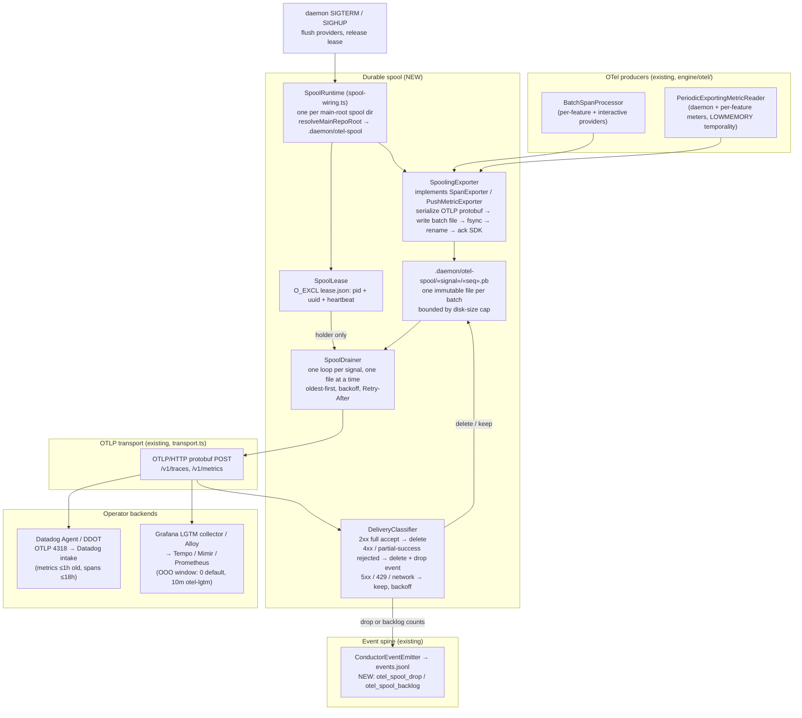

# Components: Durable OTel export spool

**Last updated:** 2026-09-29
**Scope:** Where a write-first, disk-backed spool sits between the existing OTel SDK processors
(`BatchSpanProcessor`, `PeriodicExportingMetricReader`) and the OTLP transport, so telemetry
survives backend outage, local collector outage, daemon restart/crash, and network partition.
Backend targets: Datadog Agent / DDOT and Grafana LGTM (otelcol-contrib or Alloy).

## Diagram

## Legend

- **NEW** — the spool layer. The SDK producers are unchanged; only the exporter they are handed
  changes. The SDK sees an export succeed as soon as the batch is durable on disk, so SDK-side
  retry, `maxQueueSize` drops, and the delta-interval loss on a failed metric export no longer occur.
- **Write-first:** every batch is persisted before any network send, so a daemon crash loses at
  most the SDK's un-exported in-memory window, never an accepted batch.
- **Backend decides staleness:** the spool applies no client-side age cap. A permanent rejection
  is deleted and counted on the spine; only transient failures are retried. The disk-size cap is
  the sole local bound; its eviction is also counted on the spine.
- **Single drainer:** multiple writer processes (daemon, per-feature providers, interactive runs)
  append independent batch files; exactly one drainer per project root holds the lease.
- `file` exporter transport is unchanged and not spooled (it is already local disk).

## Change Log

| Date | Change | Reason |
|------|--------|--------|
| 2026-09-29 | Initial generation | DECIDE for durable OTel export queue |
| 2026-09-29 | Added SpoolRuntime, SpoolLease and the SIGTERM/SIGHUP flush path | Plan update after the conflict-check resolutions (C3, C5) |
