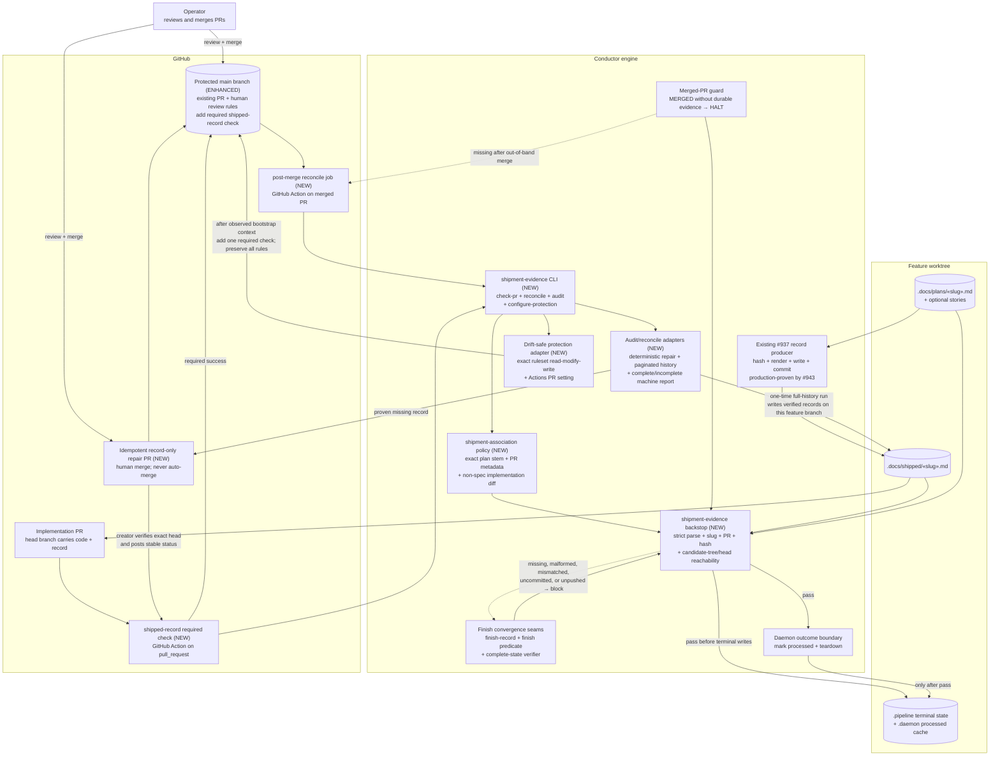

# Components: durable shipped-record enforcement and backfill (#916, #936)

**Last updated:** 2026-07-25
**Scope:** Engine-owned durable shipment evidence, protected-branch enforcement, post-merge
repair PRs, and the one-time historical audit. Technical track, tier M. Existing record
rendering and GitHub/daemon seams are reused; no new service or database is introduced.

## Diagram

## Legend

- **Shared durable-evidence verifier** is the single policy seam used by engine completion,
  daemon ship/teardown, merged-PR handling, and the GitHub Action. It validates content and Git
  reachability; ignored local markers never substitute for repository evidence.
- **Protected `main`** already requires a squash pull request, one approving review, and code-owner
  review through repository ruleset `15933604`. This feature adds the shipped-record status check
  to that existing ruleset; it does not replace or weaken the current protections.
- **Repair PR** is record-only, idempotent, and human-merged. The Action never directly pushes to
  `main` and never auto-merges, preserving the existing non-autonomy boundary.
- **Proven association** means repository/GitHub evidence identifies both a plan/spec and its
  merged implementation PR. A local processed marker is corroborating evidence, not authority.
- **Protection cutover** occurs only after the bootstrap PR emits the stable context. The adapter
  refuses live-rule drift instead of reconstructing or weakening ruleset `15933604`.
- Dotted edges are blocking or recovery paths. `«»` denotes variable values.
- **#937/#943 baseline** remains the ordinary producer path. This feature does not replace it or
  change record schema/hash resolution; the new verifier prevents other engine and merge paths from
  claiming success without its durable output.

## Change Log

| Date | Change | Reason |
|------|--------|--------|
| 2026-07-25 | Initial generation | DECIDE architecture for issues #916/#936 and repaired example PR #877 |
| 2026-07-25 | Corrected `main` protection baseline | Ruleset inspection showed active PR/review protection; only the required evidence check is missing |
| 2026-07-25 | Added planned policy, CLI, audit, and protection seams | `/plan` fixed the module boundaries, call paths, repair-head status, and safe cutover sequence |
| 2026-07-25 | Narrowed around verified #937/#943 baseline | Current `main` already produces records on the ordinary finish path; remaining work is enforcement and recovery |
