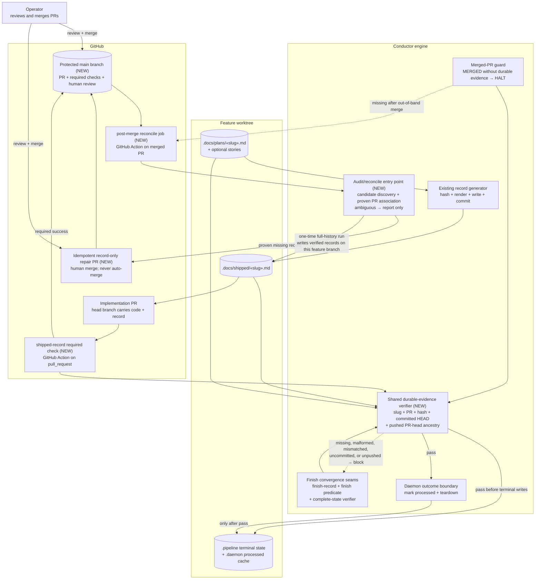

# Components: durable shipped-record enforcement and backfill (#916, #936)

**Last updated:** 2026-07-25
**Scope:** Engine-owned durable shipment evidence, protected-branch enforcement, post-merge
repair PRs, and the one-time historical audit. Technical track, tier M. Existing record
rendering and GitHub/daemon seams are reused; no new service or database is introduced.

## Diagram

## Legend

- **Shared durable-evidence verifier** is the single policy seam used by engine completion,
  daemon ship/teardown, merged-PR handling, and the GitHub Action. It validates content and Git
  reachability; ignored local markers never substitute for repository evidence.
- **Protected `main`** requires pull requests, human review, and the shipped-record status check.
  The repository currently lacks protection; adding it is part of this feature's operational
  delivery.
- **Repair PR** is record-only, idempotent, and human-merged. The Action never directly pushes to
  `main` and never auto-merges, preserving the existing non-autonomy boundary.
- **Proven association** means repository/GitHub evidence identifies both a plan/spec and its
  merged implementation PR. A local processed marker is corroborating evidence, not authority.
- Dotted edges are blocking or recovery paths. `«»` denotes variable values.

## Change Log

| Date | Change | Reason |
|------|--------|--------|
| 2026-07-25 | Initial generation | DECIDE architecture for issues #916/#936 and repaired example PR #877 |
