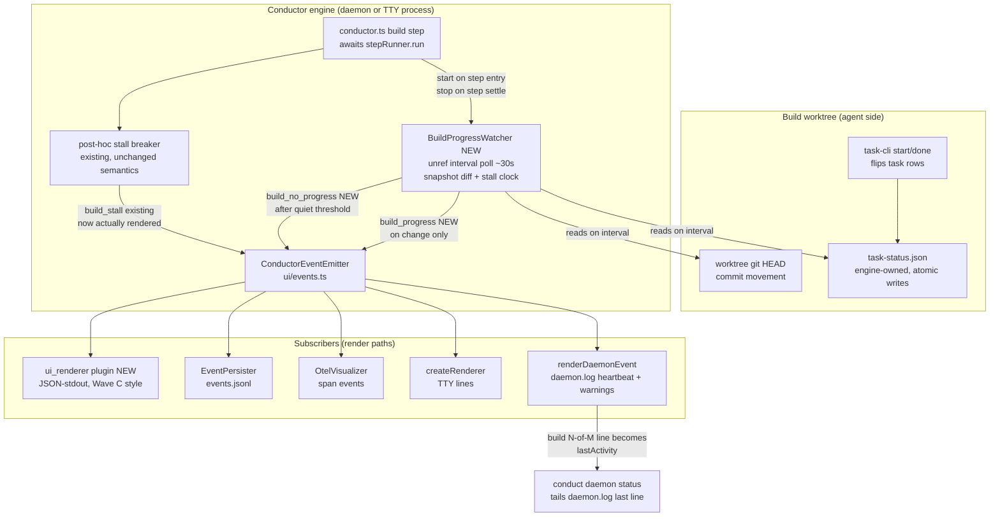

# Components: Intra-step Build Progress + Stall Events (issue #347)

**Last updated:** 2026-07-10
**Scope:** L3 component view of the new build-progress watcher, the two new
`ConductorEvent` kinds it emits, and every subscriber render path that consumes
them. Amends the Phase 9.1 emission-path view (`2026-06-25-phase-9.1-emission-path.md`)
and builds on the Wave C subscriber ruling (JSON-stdout `ui_renderer` plugin, no
`index.ts` edits).

## Diagram

## Legend

- **NEW** — components or event kinds introduced by this feature.
- `BuildProgressWatcher` — new engine module; owns the interval timer, the last-seen
  snapshot (resolved count, current task id, worktree HEAD), and the quiet-period
  clock. Emits on *change*, never on a fixed cadence, except a low-frequency
  heartbeat re-emit so `daemon status` stays fresh.
- `build_stall` — existing event, emitted at `conductor.ts:1762`; today no renderer
  handles it (TTY and daemon renderers both drop it, OTel never subscribes). This
  feature adds render cases; emission semantics are unchanged.
- The bus (`ConductorEventEmitter`) swallows subscriber errors — a broken renderer
  cannot crash the engine (Wave B isolation, preserved).
- The `ui_renderer` plugin follows the Wave C ruling: discoverable via `plugin.yml`,
  zero edits to `src/index.ts`, one JSON line per event on stdout.

## Change Log

| Date | Change | Reason |
|------|--------|--------|
| 2026-07-10 | Initial generation | DECIDE phase for issue #347 |
