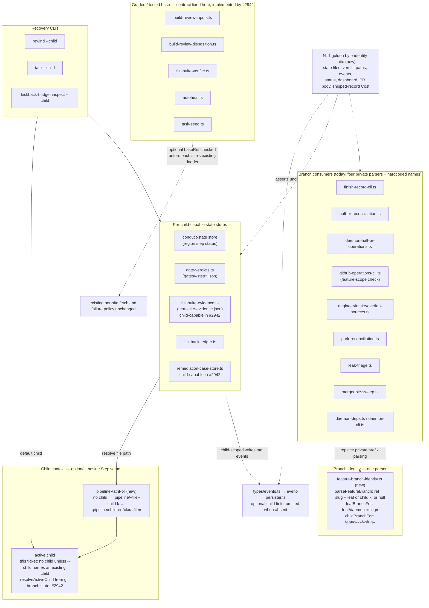
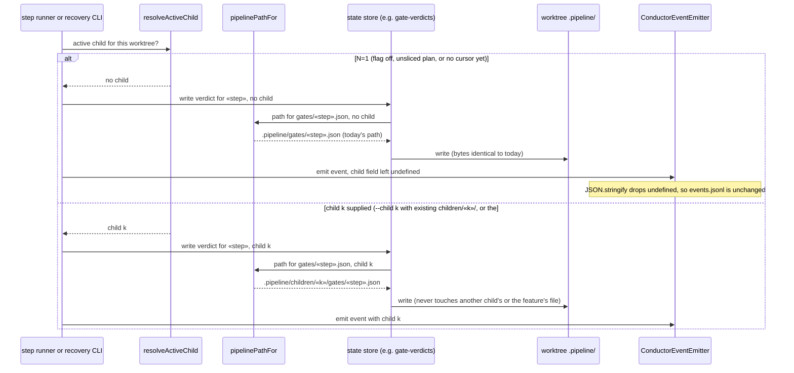

# Components: Stack-aware feature identity and per-child state foundation (#2940)

**Last updated:** 2026-10-03
**Scope:** The foundation every stacked-delivery ticket (#2941–#2945) builds on. Four seams are
added beside existing engine machinery: one shared feature-branch identity parser, an optional
child context with a per-child `.pipeline/` storage namespace, an optional per-site base
override, and an optional `child` field on the event spine. The `--child` argument on the
recovery CLIs is added too. None of these seams has a live producer of a child yet. This ticket
builds the identity parser, the per-child path seam and its step-status, gate-verdict and ledger
stores, the event field, and the `--child` CLIs. The base override and active-child resolution are
fixed as contracts here and implemented by #2942. Without `--child` naming an existing child,
everything resolves to "no child", so at N=1 every persisted byte stays as it is today. Out of scope: the active-child cursor and halt-to-leaf (#2942), restack
(#2943), fix routing (#2944), the child-to-PR map, publication and child-branch teardown (#2945).

## Diagram — component seams

## Diagram — state access at N=1 and with a child

## Legend

- **`feature-branch-identity.ts`** becomes the single owner of "which feature does this branch
  belong to, and is it the leaf or child k". Today four modules parse slugs privately
  (`finish-record-cli.ts`, `halt-pr-reconciliation.ts`, `daemon-halt-pr-operations.ts`,
  `github-operations-cli.ts`, with `DAEMON_BRANCH_PREFIX` defined twice), and several more
  hardcode `feat/daemon-${slug}` or glob `feat/daemon-*`. The leaf keeps `feat/daemon-«slug»`.
  Children are `feat/c«k»/«slug»` (operator decision). A slug never contains `/`, so the parse
  is unambiguous, and the name has no git directory/file conflict with the leaf.
- **Child context** is orthogonal to `StepName`. No step-name type changes. `StepName` appears
  at more than 300 sites, so a typed `{kind, childId}` identity was rejected. A store asked for
  "no child" resolves today's path, so N=1 byte-identity is structural, not something asserted
  after the fact. The golden suite proves it anyway.
- **`pipelinePathFor`** is the one place a per-child path is formed. Directory sweeps over
  `.pipeline/gates/` (for example `gate-verdicts.ts` readdir) must not descend into
  `children/`.
- **Base override** is an optional input consumed *before* each site's existing ladder. The four
  graded/tested-base sites share a primitive but differ deliberately in fetch policy and failure
  semantics (throw, fall back to the fresh base, run the aggregate suite, or widen to `HEAD`). A
  single unified resolver would change three of them at N=1, so they stay separate.
- **Events** gain an optional `child` that is left `undefined` (never `null`) at N=1. The
  persister spreads the event into `JSON.stringify` with no key sorting or hashing, so an absent
  field leaves `events.jsonl` byte-identical.
- **Recovery CLIs** accept `--child «k»` and otherwise default to `resolveActiveChild`. Until
  #2942 that means "no child", so today's invocations and runbook recipes behave exactly as now.
- Dashed edges are constraints or assertions, not runtime calls.

## Change Log

| Date | Change | Reason |
|---|---|---|
| 2026-10-03 | Initial diagram. | Make the identity, child-context, base-override and event seams explicit before implementation (#2940). This ticket builds the identity, the per-child storage reached by the recovery CLIs, and the event field. The base override and active-child resolution are #2942's. |
