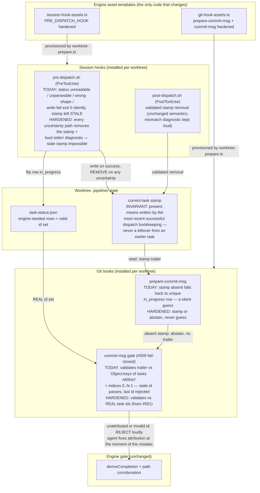
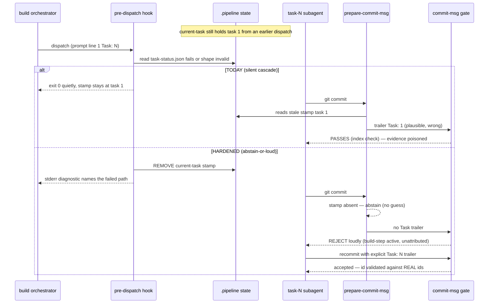

# Component Diagram: Attribution Abstain-or-Loud Hardening (#519)

**Last updated:** 2026-07-11
**Scope:** Fixes the silent misattribution cascade in the #494 attribution machinery. In the
#492 build, `.pipeline/current-task` froze at task 1's id and every later commit (tasks 2–16)
was silently stamped `Task: 1`; the evidence gate then rejected 100% of finished work and the
build halted with retries exhausted. Root class (all code-verified): (1) `pre-dispatch.sh` has
four silent exit-0 paths that leave a STALE stamp in place when `task-status.json` is
unreadable, unparseable, wrong-shaped, or the atomic write fails; (2) `prepare-commit-msg`
falls back to guessing the id from the unique in_progress row when the stamp is absent;
(3) `commit-msg` validates trailer ids against `Object.keys` of the tasks ARRAY — array
indices, not real ids — so a stale-but-plausible id always passes (and the last task's id is
wrongly rejected; same defect line as #501). This feature converts every uncertainty into
abstain-or-loud: a stale stamp is impossible, a guess is impossible, and an invalid or missing
attribution fails loudly at commit time — the point of violation — not at end-of-build
evidence. Deliberately NOT parallel-native attribution (that is F4/#474 territory); the
overlap-guard clear-on-switch semantics are unchanged.

## Diagram

## Sequence: task N dispatch whose bookkeeping fails (the #519 shape)

## Legend

- **HARDENED** — behavior this feature changes; everything else (#452 state shapes, #494
  dispatch grammar and overlap guard, #509 marker semantics, the evidence gate) keeps its
  exact semantics.
- **Abstain-or-loud invariant** — the machinery may fail to attribute, but it may never
  attribute WRONGLY: uncertainty removes the stamp (abstain) and says so on stderr (loud);
  the gate then converts abstention into an instructive commit rejection the agent can fix
  immediately with a self-stamped, real-id-validated trailer.
- **Cascade breaker** — a stale-but-valid id (task 1) is indistinguishable from a correct
  trailer to every downstream check; the stamp file is therefore the only place the cascade
  can be broken. That is why the pre-dispatch uncertainty paths must remove it.
- **Out of scope** — parallel-native attribution (one global stamp cannot represent two
  in-flight tasks; live evidence in the #520 build). Filed separately (F4) as a prerequisite
  of #474. The overlap guard's clear-on-switch already degrades parallel dispatch to the
  abstain path, which this feature makes safe.
- **#501** — the real-id validation fix shares the defective code line with open issue #501
  (numeric-id rejection); this spec resolves both.

## Change Log

| Date | Change | Reason |
|------|--------|--------|
| 2026-07-11 | Initial generation | DECIDE phase for #519 (engineer worktree) |
