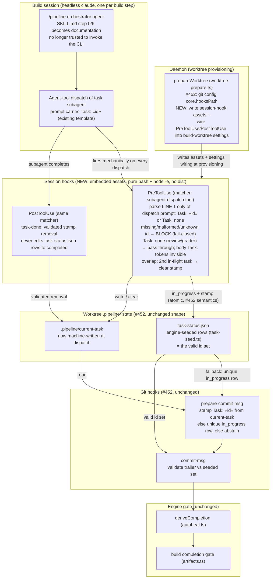
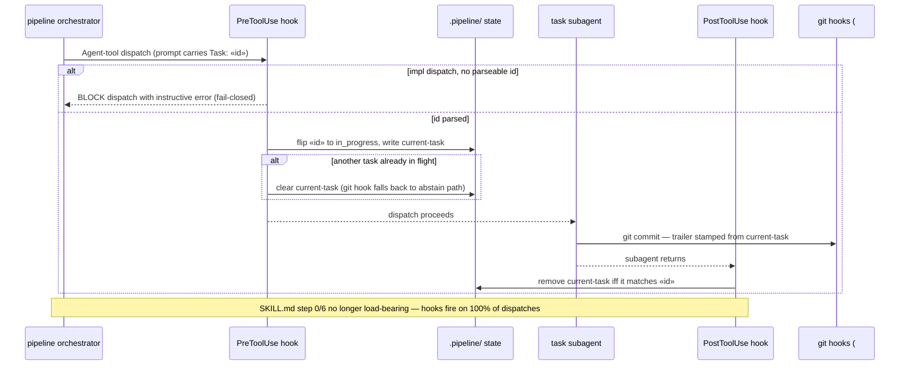

# Component Diagram: Engine-Invoked Task Start/Done at Subagent Dispatch (#477)

**Last updated:** 2026-07-10
**Scope:** Closes the last prompt-discipline link in the #433/#452 attribution chain. Today
`skills/pipeline/SKILL.md` step 0 *instructs* the orchestrator agent to run `conduct-ts task
start «id»` before each subagent dispatch — nothing deterministic fires it, so builds converge
only when the agent complies. This feature installs Claude-session PreToolUse/PostToolUse
hooks (matched on the subagent-dispatch tool) at worktree provisioning; the hooks stamp
`.pipeline/current-task` and flip `task-status.json` mechanically on every dispatch,
fail-closed. The Node engine still never sees task boundaries (one headless `/pipeline`
session per build step) — the session hook IS the engine's proxy at the dispatch boundary.
Everything downstream (#452 git hooks, evidence gate) is unchanged.

## Diagram

## Sequence: one per-task dispatch under #477

## Legend

- **NEW** — surfaces this feature adds; #452 state files, git hooks, and the evidence gate
  keep their exact shapes and semantics (the gate stays the single completion authority).
- **Fail-closed** — an implementation dispatch whose prompt carries no parseable task id is
  rejected at dispatch time (instant, orchestrator-visible), not discovered 13 unevidenced
  tasks later at the build gate.
- **Embedded assets, no dist** — session hooks follow git-hook-assets.ts precedent: pure
  bash + inline `node -e`, written per worktree at provisioning; they never invoke the
  worktree's built engine, so they cannot run stale engine code (#403 class).
- **Overlap guard** — parallel dispatch cannot be represented by a single stamp; clearing it
  degrades to #452's abstain-on-ambiguity (unique-in_progress fallback), never a wrong stamp.
- **Spike gate** — the design assumes PreToolUse tool-matcher hooks fire in headless
  `--print` sessions (verified interactive-only so far); architecture review must confirm
  with a one-shot headless probe before build.
- `«id»` — placeholder for a plan task id.

## Change Log

| Date | Change | Reason |
|------|--------|--------|
| 2026-07-10 | Initial generation | DECIDE phase for #477 (engineer worktree) |
| 2026-07-10 | Marker grammar tightened to line-1-only (`Task: «id»` / `Task: none`) | Conflict resolution vs #417/#302 trailer-instruction `Task:` tokens in prompt bodies |
