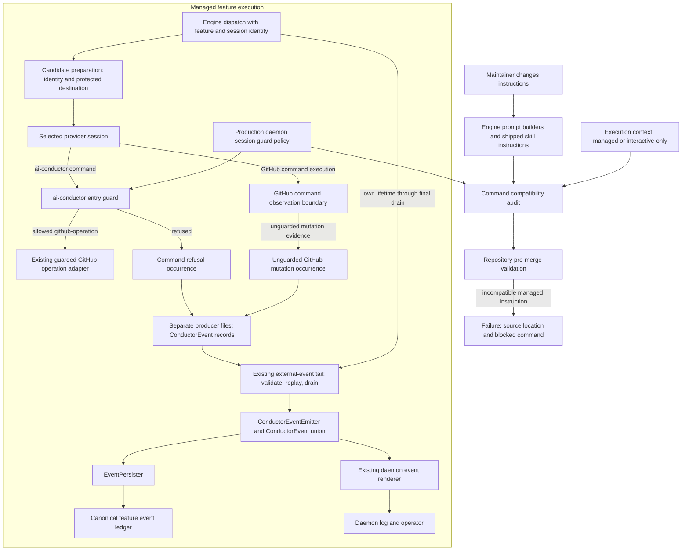

# Components: Daemon session command compatibility and visibility

**Last updated:** 2026-10-02
**Scope:** Proposed component responsibilities for #2709, Approach A, technical track, Medium. This diagram separates pre-merge checking from runtime reporting; it is a design for review, not a claim that these integrations already exist.

## Diagram

## Legend and responsibilities

- The pre-merge audit reads the production guard's policy; it does not define a second command permission list. A finding identifies the instruction location and blocked subcommand.
- Execution context distinguishes managed instructions from legitimate operator-only commands. Historical examples and descriptions of prohibited commands are not executable instructions.
- The existing entry guard retains refusal authority. A runtime event must not turn a refused command into a permitted command.
- The observation boundary reports evidence of a GitHub mutation outside the approved adapter. An attempted invocation and a confirmed successful mutation must not be conflated.
- Feature/session identity originates at engine dispatch and survives changed working directories and nested session processes.
- Spine arrows express schema and delivery ownership. An external writer cannot append concurrently to the engine-owned ledger; architecture review must select the concrete transport and prove concurrency safety.
- Reporting contains bounded operation identity and attribution, not raw shell text, request bodies, credentials, or environment dumps.
- All supported provider paths share the outcome. The concrete observation seam and its coverage limits require architectural approval before stories and implementation tasks are authored.
- No new external service, database, or autonomous daemon lifecycle is introduced.

## Evidence and design status

Verified source anchors: execution/daemon-session.ts (guard and marker); index.ts main (early refusal); engine/github-invocation-audit.ts (source-audit precedent); types/events.ts, engine/event-sinks.ts, engine/event-persister.ts (canonical schema and sinks); engine/closeout-events.ts and engine/closeout-tail.ts (external-process event precedent).

Governing approved decisions: adr-2026-09-11-github-operation-ownership; adr-2026-08-08-pipeline-owned-closeout-timestamps; adr-2026-07-26-event-sink-registry-exhaustiveness.

The operator approved the scope, approach, and all diagram boundaries in chat on 2026-10-01. Architecture review will decide the observation seam, external-writer serialization, and disposition of existing prompt/guard mismatches; diagram approval does not silently approve any of those decisions.

> **Amended 2026-10-01 by #2709:** The operator subsequently approved adr-2026-10-01-daemon-session-command-contracts. GitHub observation uses the bounded managed gh wrapper. Separate producer files carry ConductorEvent records into the extended existing tail and canonical projection, owned across the feature lifetime. Engine-owned FINISH recording and operator-only configuration setup govern prompt corrections. The diagram arrows remain the same responsibility boundaries; the ADR supplies their approved concrete integrations.

## Change Log

| Date | Change | Reason |
|------|--------|--------|
| 2026-10-01 | Initial component view | DECIDE for #2709 |

### Plan update — 2026-10-02

Tasks 7–19 specify preparation, per-producer canonical-schema files, the existing tail and acknowledged canonical projection. Task 13 owns start-before-dispatch and drain-before-detach; no second event bus or daemon poller is added. Existing native read-only protection remains binding, with unsupported observation destinations refused before launch.
