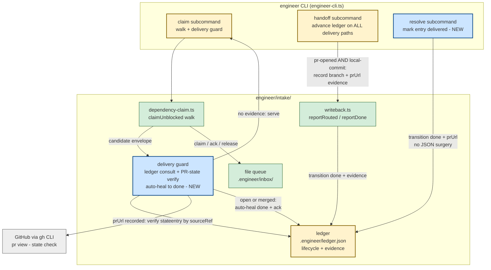

# Components (L3): Engineer Claim Delivery Guard (#243)

**Last updated:** 2026-07-04
**Scope:** Changes to the `src/conductor/src/engine/engineer/intake/` layer and the
`engineer` CLI for the stale-`claimed` re-dispatch fix: claim-time delivery guard,
handoff ledger advance on all delivery paths, and the `engineer resolve` recovery
primitive. Companion to `components-engineer-intake.md` (9.3b baseline).

## Diagram

## Legend

- **Blue (new):** the delivery guard inside the claim walk and the `engineer resolve`
  recovery subcommand.
- **Yellow (changed):** the `claim` and `handoff` CLI cases and the ledger's lifecycle
  semantics (delivery evidence now gates re-dispatch; local-commit fallback records
  evidence instead of silently stranding `claimed`).
- **Green (existing):** the 9.3b file queue, dependency walk, and write-back helpers —
  reused, not restructured.

## Key invariants encoded

1. **An entry carrying delivery evidence (`prUrl`) whose PR is open or merged is never
   served by `claim`** — the guard auto-heals it to `done` and drops its envelope.
2. **PR-state lookup failure fails safe:** the candidate is skipped (left pending),
   never served — uncertainty must not author a duplicate spec.
3. **Closed-unmerged PRs keep FR-39/40 semantics** — re-eligibility flows through the
   existing reopen + churn-cap path, not a new bypass.
4. **Every handoff delivery outcome records evidence in the ledger** — a gh write-back
   failure (#290 family) can no longer strand `claimed`-with-no-evidence state.
5. **Recovery is a primitive, not JSON surgery** — `engineer resolve` is the sanctioned
   way to mark an entry delivered after a manual fix-up.

## Change Log

| Date | Change | Reason |
|------|--------|--------|
| 2026-07-04 | Initial generation | #243 claim delivery guard spec (engineer DECIDE) |
