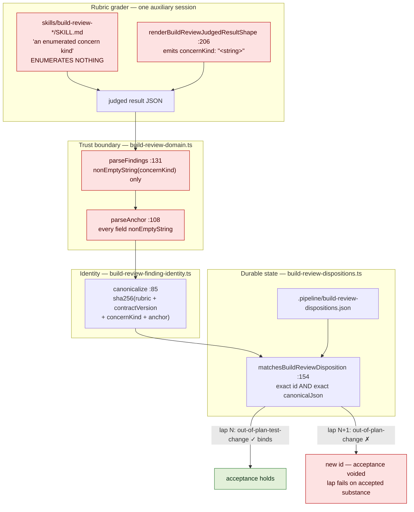
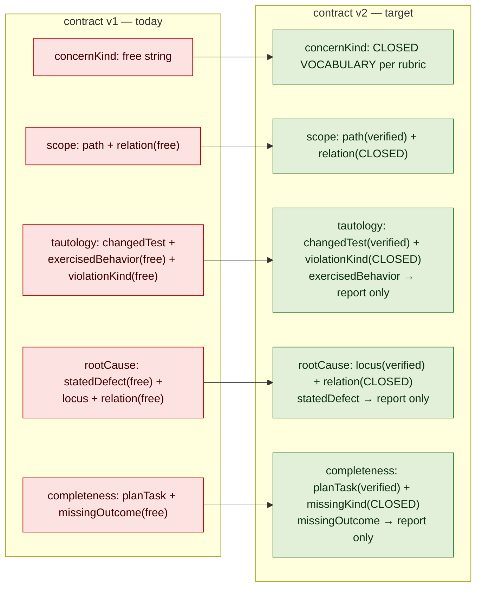
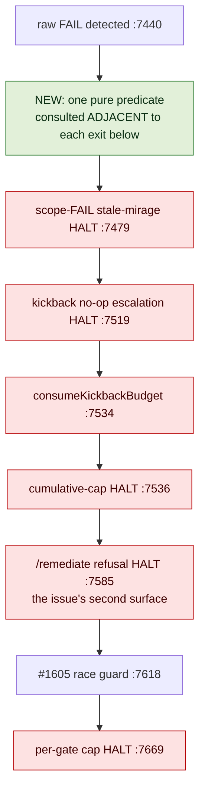

# Architecture: Closing the build_review finding-identity vocabulary

**Last updated:** 2026-08-16
**Scope:** The `build_review` result contract and disposition-resolution path —
`build-review-domain.ts`, `build-review-finding-identity.ts`, `build-review-dispositions.ts`,
`build-review-aggregate.ts`'s effective reducers, the four `skills/build-review-*/SKILL.md` result
contracts, and the daemon `build_review` FAIL block in `conductor.ts`. Covers both surfaces filed
as jstoup111/ai-conductor#1611.
All line references are at worktree base `cab8df856`.

## Diagram: where identity drifts today (L3)

## Legend

- **Red** — the unimplemented half of `adr-2026-08-13`. Free text is admitted at the skill contract,
  at the emitted schema, and at the parser, so it reaches the hash and the id moves whenever the
  grader re-words. `matchesBuildReviewDisposition` is not the defect; it is correct, and the ADR
  requires it to stay exact.

## Diagram: identity inputs, before and after

Every surviving identity input is either a **closed vocabulary member** or a **reference the engine
can verify against the immutable snapshot**. Neither can be re-worded, so the id is stable by
construction rather than by grader discipline. Prose that identifies a subject in human terms moves
to the report, joining `summary` and `evidenceLocations`, which the ADR already excludes.

Completeness gains a verified missing-surface reference alongside `planTask`. Without it, identity
would reduce to `{rubric, version, missingKind, planTask}` and two genuinely different missing
deliverables under one plan task would collapse to one id — outcome 2 violated by the very change
that serves outcome 1.

**Normalization runs before validation.** An emitted value is lowercased and has `_` folded to `-`,
then checked for membership. Measured over `.daemon/evals-raw`, that folds 82 raw distinct
`concernKind` values to 70 — 12 pairs such as `missing_deliverable`/`missing-deliverable` and
`out-of-plan-change`/`out_of_plan_change` are one concept in two spellings, and become hits rather
than rejections. The guard: normalization may map to at most one member of a set, asserted by test,
so it can never resolve ambiguously at runtime.

## Why this does not become blanket path immunity

Desired outcome 2 requires that genuinely different findings at the same paths still surface. The
classification member is what preserves that:

| Two findings on the same `path` | v1 today | structural-only (rejected) | v2 target |
|---|---|---|---|
| Same substance, re-worded | different ids — **acceptance voided** | same id | same id — acceptance holds |
| Different substance, same path | different ids | **same id — both accepted at once** | different ids — second surfaces |

The rejected structural-only hypothesis collapses the bottom row; dropping only the *prose* while
keeping the *classification* collapses neither.

## Diagram: routing-time re-resolution (surface 2)

Today only `#1605 race guard` reads effective state; everything upstream of it decides on the raw
aggregate, including four terminal HALTs and the budget consumption.

**Why a predicate at each exit rather than one resolution at the top.**
`adr-2026-07-12-judged-attribution-verdict-persistence` fixed this exact defect class by moving the
read *later, adjacent to the decision*, and `adr-2026-07-13-park-all-dispatch-paths` demoted its early
check to "a cheap early filter … no longer the last word". A single top-of-block resolution makes the
early read the only read across exits that mutate in between — `consumeKickbackBudget` mutates and the
`/remediate` planner takes minutes — reopening one level up the very window #1605 was written to
close. The exit set is derived by grep at implementation time, not from the six drawn here.

**Ordering constraint.** `adr-2026-07-27-daemon-decide-kickback-halt` fixes cap-first ordering so a
run that trips a cap reports the ping-pong reason rather than having it masked by a later one. The
hoist therefore computes the effective verdict early but must not *reorder* the cap checks
themselves; it supplies each existing exit with better input in place. `adr-2026-08-12`'s
"incremented on every kickback consumed" is satisfied because a lap resolved to effective PASS
consumes no kickback at all.

**Prior art.** `adr-2026-07-12-judged-attribution-verdict-persistence` is the same bug and the same
fix — a stale pre-computed completion snapshot read after new state had been written, repaired by
recomputing before the decision rather than by patching each consumer.

## Failure posture

| Condition | Outcome |
|---|---|
| Grader emits an out-of-vocabulary `concernKind` or classification | Contract violation → #1605's bounded repair turn → if repair fails, `invalid-provider-result` infrastructure failure, which **blocks** and surfaces a bounded raw excerpt |
| Disposition recorded under contract `v1` | Does not bind a `v2` identity — as `adr-2026-08-13` requires — and is **reported** as version-invalidated, never silently ignored |
| Disposition store unreadable | Unchanged: a failed review, not an implicit absence of accepted findings |

Nothing in this design can suppress a finding. Every failure mode resolves toward the finding
remaining blocking and visible.
